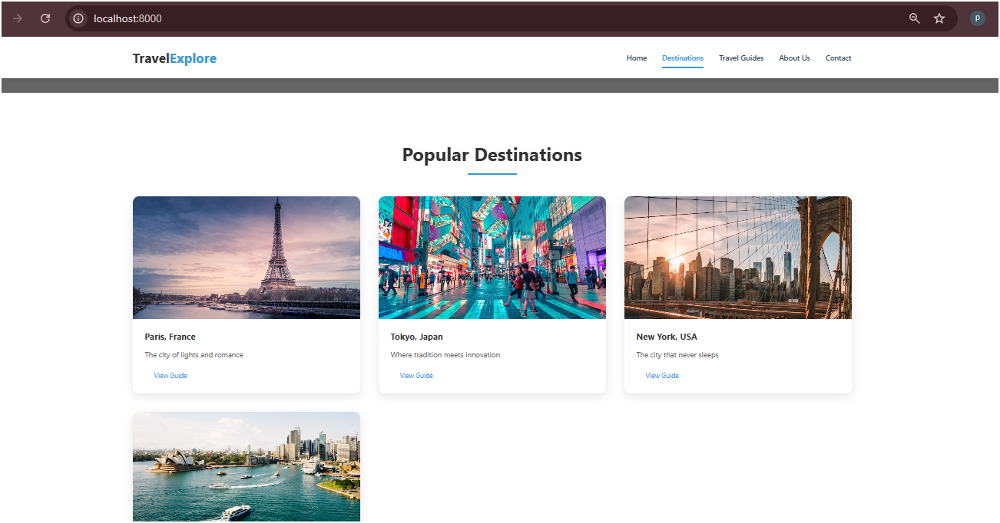

# TravelExplore

This is a static website for TravelExplore, featuring various travel destinations and guides.



## Local Development and Testing

### Prerequisites
- Python 3.x installed on your system
- A modern web browser (Chrome, Firefox, Safari, or Edge)

### Running the Website Locally

1. Open your terminal or command prompt

2. Navigate to the website directory:
   ```bash
   cd /path/to/sample-website
   ```

3. Start the Python HTTP server:
   ```bash
   python3 -m http.server 8000
   ```
   - For Python 2.x (if you don't have Python 3):
     ```bash
     python -m SimpleHTTPServer 8000
     ```

4. Access the website:
   - Open your web browser
   - Visit: http://localhost:8000
   - The index.html file will be served automatically

5. To stop the server:
   - Press `Ctrl + C` in the terminal where the server is running

### Troubleshooting

1. If port 8000 is already in use:
   - Try a different port number:
     ```bash
     python3 -m http.server 8080
     ```
   - Then access the site at http://localhost:8080

2. If images don't load:
   - Verify that all images are in the `/images` directory
   - Check image file permissions (should be readable)
   - Ensure image filenames match exactly with those referenced in index.html

### Directory Structure
```
sample-website/
├── index.html
├── error.html
├── css/
│   └── styles.css
├── js/
│   └── script.js
└── images/
    ├── paris.jpg
    ├── tokyo.jpg
    ├── new-york.jpg
    ├── sydney.jpg
    └── about-us.jpg
```

## Notes
- This is a static website meant for demonstration purposes
- All images are sourced from Unsplash and are free to use
- The website is responsive and should work well on all device sizes

