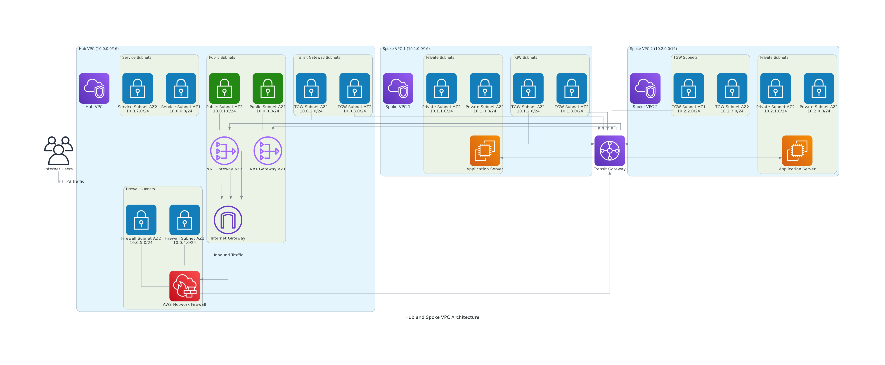

# High Availability Hub and Spoke VPC Architecture

This project implements a hub and spoke VPC architecture in AWS, consisting of one central hub VPC and two spoke VPCs. This design centralizes network connectivity and security controls while allowing for scalable and isolated workload environments.

## Architecture Overview



### Components:
- **Hub VPC**: Central VPC that manages all traffic between spokes and to external networks
- **Spoke VPCs (2)**: Isolated VPCs for different workloads or environments
- **Transit Gateway**: Core networking component that enables communication between all VPCs
- **Network Firewall**: Centralized security control in the hub VPC
- **NAT Gateways**: For outbound internet access from private subnets
- **VPC Endpoints**: For secure access to AWS services without internet exposure
- **Internet Gateway**: Provides internet connectivity to the Hub VPC
- **Route Tables**: Direct traffic between VPCs and to/from the internet
- **EC2 Instances**: Application servers deployed in private subnets of spoke VPCs
- **Security Groups**: Instance-level security controls for EC2 resources

## Network Design

### Hub VPC
- **CIDR**: 10.0.0.0/16
- **Subnets**:
  - Public subnets (10.0.0.0/24, 10.0.1.0/24) - For NAT Gateways and internet-facing resources
  - Transit Gateway attachment subnets (10.0.2.0/24, 10.0.3.0/24) - For TGW attachments
  - Firewall subnets (10.0.4.0/24, 10.0.5.0/24) - For Network Firewall endpoints
  - Service subnets (10.0.6.0/24, 10.0.7.0/24) - For shared services

### Spoke VPC 1
- **CIDR**: 10.1.0.0/16
- **Subnets**:
  - Private application subnets (10.1.0.0/24, 10.1.1.0/24)
  - Transit Gateway attachment subnets (10.1.2.0/24, 10.1.3.0/24)

### Spoke VPC 2
- **CIDR**: 10.2.0.0/16
- **Subnets**:
  - Private application subnets (10.2.0.0/24, 10.2.1.0/24)
  - Transit Gateway attachment subnets (10.2.2.0/24, 10.2.3.0/24)

## Connectivity Flow

### Inbound Traffic Flow
1. Internet traffic enters through Internet Gateway in the Hub VPC
2. Traffic passes through Network Firewall for inspection
3. Routed via Transit Gateway to the appropriate Spoke VPC
4. Reaches the target application in the Spoke VPC's private subnet

### Outbound Traffic Flow
1. Traffic originates from private subnets in Spoke VPCs
2. Routed to the Transit Gateway
3. Forwarded to the Hub VPC
4. Passes through Network Firewall for inspection
5. Exits through NAT Gateways to the internet

### East-West Traffic Flow (Between Spoke VPCs)
1. Traffic from Spoke VPC 1 routes to Transit Gateway
2. Transit Gateway forwards traffic to Hub VPC for inspection (optional)
3. Traffic is then routed to Spoke VPC 2
4. Reaches the destination in Spoke VPC 2's private subnet

## Implementation Steps

### 1. Create VPCs and Subnets
- **Hub VPC Creation**:
  ```bash
  aws ec2 create-vpc --cidr-block 10.0.0.0/16 --tag-specifications 'ResourceType=vpc,Tags=[{Key=Name,Value=Hub-VPC}]'
  ```
- **Create Hub VPC Subnets**:
  ```bash
  # Public subnets in two AZs
  aws ec2 create-subnet --vpc-id <hub-vpc-id> --cidr-block 10.0.0.0/24 --availability-zone us-east-1a --tag-specifications 'ResourceType=subnet,Tags=[{Key=Name,Value=Hub-Public-1a}]'
  aws ec2 create-subnet --vpc-id <hub-vpc-id> --cidr-block 10.0.1.0/24 --availability-zone us-east-1b --tag-specifications 'ResourceType=subnet,Tags=[{Key=Name,Value=Hub-Public-1b}]'
  
  # Transit Gateway attachment subnets
  aws ec2 create-subnet --vpc-id <hub-vpc-id> --cidr-block 10.0.2.0/24 --availability-zone us-east-1a --tag-specifications 'ResourceType=subnet,Tags=[{Key=Name,Value=Hub-TGW-1a}]'
  aws ec2 create-subnet --vpc-id <hub-vpc-id> --cidr-block 10.0.3.0/24 --availability-zone us-east-1b --tag-specifications 'ResourceType=subnet,Tags=[{Key=Name,Value=Hub-TGW-1b}]'
  
  # Firewall subnets
  aws ec2 create-subnet --vpc-id <hub-vpc-id> --cidr-block 10.0.4.0/24 --availability-zone us-east-1a --tag-specifications 'ResourceType=subnet,Tags=[{Key=Name,Value=Hub-FW-1a}]'
  aws ec2 create-subnet --vpc-id <hub-vpc-id> --cidr-block 10.0.5.0/24 --availability-zone us-east-1b --tag-specifications 'ResourceType=subnet,Tags=[{Key=Name,Value=Hub-FW-1b}]'
  
  # Service subnets
  aws ec2 create-subnet --vpc-id <hub-vpc-id> --cidr-block 10.0.6.0/24 --availability-zone us-east-1a --tag-specifications 'ResourceType=subnet,Tags=[{Key=Name,Value=Hub-Service-1a}]'
  aws ec2 create-subnet --vpc-id <hub-vpc-id> --cidr-block 10.0.7.0/24 --availability-zone us-east-1b --tag-specifications 'ResourceType=subnet,Tags=[{Key=Name,Value=Hub-Service-1b}]'
  ```

- **Spoke VPC 1 Creation**:
  ```bash
  aws ec2 create-vpc --cidr-block 10.1.0.0/16 --tag-specifications 'ResourceType=vpc,Tags=[{Key=Name,Value=Spoke-VPC-1}]'
  ```
- **Create Spoke VPC 1 Subnets**:
  ```bash
  # Private application subnets
  aws ec2 create-subnet --vpc-id <spoke1-vpc-id> --cidr-block 10.1.0.0/24 --availability-zone us-east-1a --tag-specifications 'ResourceType=subnet,Tags=[{Key=Name,Value=Spoke1-Private-1a}]'
  aws ec2 create-subnet --vpc-id <spoke1-vpc-id> --cidr-block 10.1.1.0/24 --availability-zone us-east-1b --tag-specifications 'ResourceType=subnet,Tags=[{Key=Name,Value=Spoke1-Private-1b}]'
  
  # Transit Gateway attachment subnets
  aws ec2 create-subnet --vpc-id <spoke1-vpc-id> --cidr-block 10.1.2.0/24 --availability-zone us-east-1a --tag-specifications 'ResourceType=subnet,Tags=[{Key=Name,Value=Spoke1-TGW-1a}]'
  aws ec2 create-subnet --vpc-id <spoke1-vpc-id> --cidr-block 10.1.3.0/24 --availability-zone us-east-1b --tag-specifications 'ResourceType=subnet,Tags=[{Key=Name,Value=Spoke1-TGW-1b}]'
  ```

- **Spoke VPC 2 Creation**:
  ```bash
  aws ec2 create-vpc --cidr-block 10.2.0.0/16 --tag-specifications 'ResourceType=vpc,Tags=[{Key=Name,Value=Spoke-VPC-2}]'
  ```
- **Create Spoke VPC 2 Subnets**:
  ```bash
  # Private application subnets
  aws ec2 create-subnet --vpc-id <spoke2-vpc-id> --cidr-block 10.2.0.0/24 --availability-zone us-east-1a --tag-specifications 'ResourceType=subnet,Tags=[{Key=Name,Value=Spoke2-Private-1a}]'
  aws ec2 create-subnet --vpc-id <spoke2-vpc-id> --cidr-block 10.2.1.0/24 --availability-zone us-east-1b --tag-specifications 'ResourceType=subnet,Tags=[{Key=Name,Value=Spoke2-Private-1b}]'
  
  # Transit Gateway attachment subnets
  aws ec2 create-subnet --vpc-id <spoke2-vpc-id> --cidr-block 10.2.2.0/24 --availability-zone us-east-1a --tag-specifications 'ResourceType=subnet,Tags=[{Key=Name,Value=Spoke2-TGW-1a}]'
  aws ec2 create-subnet --vpc-id <spoke2-vpc-id> --cidr-block 10.2.3.0/24 --availability-zone us-east-1b --tag-specifications 'ResourceType=subnet,Tags=[{Key=Name,Value=Spoke2-TGW-1b}]'
  ```

### 2. Set Up Transit Gateway
- **Create Transit Gateway**:
  ```bash
  aws ec2 create-transit-gateway --description "Hub-Spoke Transit Gateway" --options "AmazonSideAsn=64512,AutoAcceptSharedAttachments=disable,DefaultRouteTableAssociation=enable,DefaultRouteTablePropagation=enable,VpnEcmpSupport=enable,DnsSupport=enable"
  ```

- **Create Transit Gateway Attachments**:
  ```bash
  # Hub VPC attachment
  aws ec2 create-transit-gateway-vpc-attachment \
    --transit-gateway-id <tgw-id> \
    --vpc-id <hub-vpc-id> \
    --subnet-ids <hub-tgw-subnet-1a-id> <hub-tgw-subnet-1b-id> \
    --tag-specifications 'ResourceType=transit-gateway-attachment,Tags=[{Key=Name,Value=Hub-VPC-Attachment}]'
  
  # Spoke VPC 1 attachment
  aws ec2 create-transit-gateway-vpc-attachment \
    --transit-gateway-id <tgw-id> \
    --vpc-id <spoke1-vpc-id> \
    --subnet-ids <spoke1-tgw-subnet-1a-id> <spoke1-tgw-subnet-1b-id> \
    --tag-specifications 'ResourceType=transit-gateway-attachment,Tags=[{Key=Name,Value=Spoke1-VPC-Attachment}]'
  
  # Spoke VPC 2 attachment
  aws ec2 create-transit-gateway-vpc-attachment \
    --transit-gateway-id <tgw-id> \
    --vpc-id <spoke2-vpc-id> \
    --subnet-ids <spoke2-tgw-subnet-1a-id> <spoke2-tgw-subnet-1b-id> \
    --tag-specifications 'ResourceType=transit-gateway-attachment,Tags=[{Key=Name,Value=Spoke2-VPC-Attachment}]'
  ```

- **Configure Transit Gateway Route Tables**:
  ```bash
  # Create route tables
  aws ec2 create-transit-gateway-route-table --transit-gateway-id <tgw-id> --tag-specifications 'ResourceType=transit-gateway-route-table,Tags=[{Key=Name,Value=Hub-Route-Table}]'
  aws ec2 create-transit-gateway-route-table --transit-gateway-id <tgw-id> --tag-specifications 'ResourceType=transit-gateway-route-table,Tags=[{Key=Name,Value=Spoke-Route-Table}]'
  
  # Associate route tables with attachments
  aws ec2 associate-transit-gateway-route-table --transit-gateway-route-table-id <hub-rt-id> --transit-gateway-attachment-id <hub-attachment-id>
  aws ec2 associate-transit-gateway-route-table --transit-gateway-route-table-id <spoke-rt-id> --transit-gateway-attachment-id <spoke1-attachment-id>
  aws ec2 associate-transit-gateway-route-table --transit-gateway-route-table-id <spoke-rt-id> --transit-gateway-attachment-id <spoke2-attachment-id>
  
  # Create routes
  aws ec2 create-transit-gateway-route --transit-gateway-route-table-id <spoke-rt-id> --destination-cidr-block 0.0.0.0/0 --transit-gateway-attachment-id <hub-attachment-id>
  aws ec2 create-transit-gateway-route --transit-gateway-route-table-id <hub-rt-id> --destination-cidr-block 10.1.0.0/16 --transit-gateway-attachment-id <spoke1-attachment-id>
  aws ec2 create-transit-gateway-route --transit-gateway-route-table-id <hub-rt-id> --destination-cidr-block 10.2.0.0/16 --transit-gateway-attachment-id <spoke2-attachment-id>
  ```

### 3. Configure Security Controls
- **Deploy AWS Network Firewall**:
  ```bash
  # Create Network Firewall policy
  aws network-firewall create-firewall-policy \
    --firewall-policy-name hub-fw-policy \
    --firewall-policy '{"StatelessDefaultActions":["aws:forward_to_sfe"],"StatelessFragmentDefaultActions":["aws:forward_to_sfe"],"StatefulRuleGroupReferences":[]}' \
    --description "Hub VPC Firewall Policy"
  
  # Create Network Firewall
  aws network-firewall create-firewall \
    --firewall-name hub-network-firewall \
    --firewall-policy-arn <firewall-policy-arn> \
    --vpc-id <hub-vpc-id> \
    --subnet-mappings '[{"SubnetId":"<hub-fw-subnet-1a-id>"},{"SubnetId":"<hub-fw-subnet-1b-id>"}]' \
    --description "Hub VPC Network Firewall"
  ```

- **Configure Security Groups**:
  ```bash
  # Create security group for Hub VPC
  aws ec2 create-security-group --group-name hub-sg --description "Hub VPC Security Group" --vpc-id <hub-vpc-id>
  
  # Create security group for Spoke VPC 1
  aws ec2 create-security-group --group-name spoke1-sg --description "Spoke VPC 1 Security Group" --vpc-id <spoke1-vpc-id>
  
  # Create security group for Spoke VPC 2
  aws ec2 create-security-group --group-name spoke2-sg --description "Spoke VPC 2 Security Group" --vpc-id <spoke2-vpc-id>
  
  # Add rules to allow necessary traffic
  aws ec2 authorize-security-group-ingress --group-id <spoke1-sg-id> --protocol tcp --port 22 --source-group <hub-sg-id>
  aws ec2 authorize-security-group-ingress --group-id <spoke2-sg-id> --protocol tcp --port 22 --source-group <hub-sg-id>
  ```

### 4. Establish Internet Connectivity
- **Create Internet Gateway for Hub VPC**:
  ```bash
  aws ec2 create-internet-gateway --tag-specifications 'ResourceType=internet-gateway,Tags=[{Key=Name,Value=Hub-IGW}]'
  aws ec2 attach-internet-gateway --internet-gateway-id <igw-id> --vpc-id <hub-vpc-id>
  ```

- **Deploy NAT Gateways**:
  ```bash
  # Allocate Elastic IPs
  aws ec2 allocate-address --domain vpc --tag-specifications 'ResourceType=elastic-ip,Tags=[{Key=Name,Value=Hub-NAT-EIP-1a}]'
  aws ec2 allocate-address --domain vpc --tag-specifications 'ResourceType=elastic-ip,Tags=[{Key=Name,Value=Hub-NAT-EIP-1b}]'
  
  # Create NAT Gateways
  aws ec2 create-nat-gateway --subnet-id <hub-public-subnet-1a-id> --allocation-id <eip-1a-allocation-id> --tag-specifications 'ResourceType=natgateway,Tags=[{Key=Name,Value=Hub-NAT-1a}]'
  aws ec2 create-nat-gateway --subnet-id <hub-public-subnet-1b-id> --allocation-id <eip-1b-allocation-id> --tag-specifications 'ResourceType=natgateway,Tags=[{Key=Name,Value=Hub-NAT-1b}]'
  ```

### 5. Configure VPC Endpoints
- **Set up VPC Endpoints in the Hub VPC**:
  ```bash
  # Create S3 Gateway Endpoint
  aws ec2 create-vpc-endpoint \
    --vpc-id <hub-vpc-id> \
    --service-name com.amazonaws.us-east-1.s3 \
    --route-table-ids <hub-private-rt-id> \
    --tag-specifications 'ResourceType=vpc-endpoint,Tags=[{Key=Name,Value=Hub-S3-Endpoint}]'
  
  # Create DynamoDB Gateway Endpoint
  aws ec2 create-vpc-endpoint \
    --vpc-id <hub-vpc-id> \
    --service-name com.amazonaws.us-east-1.dynamodb \
    --route-table-ids <hub-private-rt-id> \
    --tag-specifications 'ResourceType=vpc-endpoint,Tags=[{Key=Name,Value=Hub-DynamoDB-Endpoint}]'
  ```

### 6. Implement Route Tables
- **Configure Hub VPC Route Tables**:
  ```bash
  # Create public route table
  aws ec2 create-route-table --vpc-id <hub-vpc-id> --tag-specifications 'ResourceType=route-table,Tags=[{Key=Name,Value=Hub-Public-RT}]'
  
  # Create private route tables
  aws ec2 create-route-table --vpc-id <hub-vpc-id> --tag-specifications 'ResourceType=route-table,Tags=[{Key=Name,Value=Hub-Private-RT-1a}]'
  aws ec2 create-route-table --vpc-id <hub-vpc-id> --tag-specifications 'ResourceType=route-table,Tags=[{Key=Name,Value=Hub-Private-RT-1b}]'
  
  # Create TGW route table
  aws ec2 create-route-table --vpc-id <hub-vpc-id> --tag-specifications 'ResourceType=route-table,Tags=[{Key=Name,Value=Hub-TGW-RT}]'
  
  # Add routes
  aws ec2 create-route --route-table-id <hub-public-rt-id> --destination-cidr-block 0.0.0.0/0 --gateway-id <igw-id>
  aws ec2 create-route --route-table-id <hub-private-rt-1a-id> --destination-cidr-block 0.0.0.0/0 --nat-gateway-id <nat-gateway-1a-id>
  aws ec2 create-route --route-table-id <hub-private-rt-1b-id> --destination-cidr-block 0.0.0.0/0 --nat-gateway-id <nat-gateway-1b-id>
  
  # Associate route tables with subnets
  aws ec2 associate-route-table --route-table-id <hub-public-rt-id> --subnet-id <hub-public-subnet-1a-id>
  aws ec2 associate-route-table --route-table-id <hub-public-rt-id> --subnet-id <hub-public-subnet-1b-id>
  aws ec2 associate-route-table --route-table-id <hub-private-rt-1a-id> --subnet-id <hub-service-subnet-1a-id>
  aws ec2 associate-route-table --route-table-id <hub-private-rt-1b-id> --subnet-id <hub-service-subnet-1b-id>
  aws ec2 associate-route-table --route-table-id <hub-tgw-rt-id> --subnet-id <hub-tgw-subnet-1a-id>
  aws ec2 associate-route-table --route-table-id <hub-tgw-rt-id> --subnet-id <hub-tgw-subnet-1b-id>
  ```

- **Configure Spoke VPC Route Tables**:
  ```bash
  # Create Spoke 1 route tables
  aws ec2 create-route-table --vpc-id <spoke1-vpc-id> --tag-specifications 'ResourceType=route-table,Tags=[{Key=Name,Value=Spoke1-Private-RT}]'
  aws ec2 create-route-table --vpc-id <spoke1-vpc-id> --tag-specifications 'ResourceType=route-table,Tags=[{Key=Name,Value=Spoke1-TGW-RT}]'
  
  # Create Spoke 2 route tables
  aws ec2 create-route-table --vpc-id <spoke2-vpc-id> --tag-specifications 'ResourceType=route-table,Tags=[{Key=Name,Value=Spoke2-Private-RT}]'
  aws ec2 create-route-table --vpc-id <spoke2-vpc-id> --tag-specifications 'ResourceType=route-table,Tags=[{Key=Name,Value=Spoke2-TGW-RT}]'
  
  # Add routes to Transit Gateway
  aws ec2 create-route --route-table-id <spoke1-private-rt-id> --destination-cidr-block 0.0.0.0/0 --transit-gateway-id <tgw-id>
  aws ec2 create-route --route-table-id <spoke2-private-rt-id> --destination-cidr-block 0.0.0.0/0 --transit-gateway-id <tgw-id>
  
  # Associate route tables with subnets
  aws ec2 associate-route-table --route-table-id <spoke1-private-rt-id> --subnet-id <spoke1-private-subnet-1a-id>
  aws ec2 associate-route-table --route-table-id <spoke1-private-rt-id> --subnet-id <spoke1-private-subnet-1b-id>
  aws ec2 associate-route-table --route-table-id <spoke1-tgw-rt-id> --subnet-id <spoke1-tgw-subnet-1a-id>
  aws ec2 associate-route-table --route-table-id <spoke1-tgw-rt-id> --subnet-id <spoke1-tgw-subnet-1b-id>
  
  aws ec2 associate-route-table --route-table-id <spoke2-private-rt-id> --subnet-id <spoke2-private-subnet-1a-id>
  aws ec2 associate-route-table --route-table-id <spoke2-private-rt-id> --subnet-id <spoke2-private-subnet-1b-id>
  aws ec2 associate-route-table --route-table-id <spoke2-tgw-rt-id> --subnet-id <spoke2-tgw-subnet-1a-id>
  aws ec2 associate-route-table --route-table-id <spoke2-tgw-rt-id> --subnet-id <spoke2-tgw-subnet-1b-id>
  ```

### 7. Deploy EC2 Instances
- **Launch EC2 Instances in Spoke VPCs**:
  ```bash
  # Launch instance in Spoke VPC 1
  aws ec2 run-instances \
    --image-id ami-0c55b159cbfafe1f0 \
    --instance-type t3.micro \
    --subnet-id <spoke1-private-subnet-1a-id> \
    --security-group-ids <spoke1-sg-id> \
    --tag-specifications 'ResourceType=instance,Tags=[{Key=Name,Value=Spoke1-App-Server}]'
  
  # Launch instance in Spoke VPC 2
  aws ec2 run-instances \
    --image-id ami-0c55b159cbfafe1f0 \
    --instance-type t3.micro \
    --subnet-id <spoke2-private-subnet-1a-id> \
    --security-group-ids <spoke2-sg-id> \
    --tag-specifications 'ResourceType=instance,Tags=[{Key=Name,Value=Spoke2-App-Server}]'
  ```

### 8. High Availability Considerations
- **Deploy resources across multiple Availability Zones**:
  - All critical components (subnets, NAT Gateways, Network Firewall endpoints) are deployed in at least two AZs
  - Transit Gateway is inherently multi-AZ
  
- **Implement redundant NAT Gateways**:
  - One NAT Gateway per AZ to ensure high availability
  - Route tables configured to use the NAT Gateway in the same AZ
  
- **Configure failover mechanisms**:
  - Transit Gateway provides automatic failover between attachments
  - Network Firewall endpoints deployed in multiple AZs for redundancy

## Security Considerations

- **Implement least privilege access controls**:
  - Use IAM roles with specific permissions for EC2 instances
  - Implement resource-based policies for VPC endpoints
  - Use service control policies (SCPs) for organizational units

- **Use VPC Flow Logs for network traffic monitoring**:
  ```bash
  # Enable VPC Flow Logs for Hub VPC
  aws ec2 create-flow-logs \
    --resource-type VPC \
    --resource-ids <hub-vpc-id> \
    --traffic-type ALL \
    --log-destination-type cloud-watch-logs \
    --log-destination arn:aws:logs:<region>:<account-id>:log-group:vpc-flow-logs \
    --deliver-logs-permission-arn arn:aws:iam::<account-id>:role/FlowLogsRole
  ```

- **Configure AWS Network Firewall with appropriate rule sets**:
  ```bash
  # Create stateful rule group for domain filtering
  aws network-firewall create-rule-group \
    --rule-group-name domain-filter-rules \
    --type STATEFUL \
    --capacity 100 \
    --rule-group '{"RulesSource":{"RulesSourceList":{"TargetTypes":["HTTP_HOST","TLS_SNI"],"Targets":["*.malicious-domain.com"],"GeneratedRulesType":"DENYLIST"}}}' \
    --description "Block access to malicious domains"
  
  # Update firewall policy to include rule group
  aws network-firewall update-firewall-policy \
    --firewall-policy-name hub-fw-policy \
    --firewall-policy '{"StatelessDefaultActions":["aws:forward_to_sfe"],"StatelessFragmentDefaultActions":["aws:forward_to_sfe"],"StatefulRuleGroupReferences":[{"ResourceArn":"<rule-group-arn>"}]}'
  ```

- **Implement AWS Shield for DDoS protection (optional)**
- **Use AWS WAF for web application protection (optional)**

## Monitoring and Logging

- **Enable VPC Flow Logs for all VPCs**:
  ```bash
  # Create CloudWatch log group
  aws logs create-log-group --log-group-name vpc-flow-logs
  
  # Create IAM role for flow logs
  aws iam create-role --role-name FlowLogsRole --assume-role-policy-document '{"Version":"2012-10-17","Statement":[{"Effect":"Allow","Principal":{"Service":"vpc-flow-logs.amazonaws.com"},"Action":"sts:AssumeRole"}]}'
  
  # Attach policy to role
  aws iam put-role-policy --role-name FlowLogsRole --policy-name FlowLogsPolicy --policy-document '{"Version":"2012-10-17","Statement":[{"Effect":"Allow","Action":["logs:CreateLogGroup","logs:CreateLogStream","logs:PutLogEvents","logs:DescribeLogGroups","logs:DescribeLogStreams"],"Resource":"*"}]}'
  
  # Enable flow logs for all VPCs
  aws ec2 create-flow-logs --resource-type VPC --resource-ids <hub-vpc-id> <spoke1-vpc-id> <spoke2-vpc-id> --traffic-type ALL --log-destination-type cloud-watch-logs --log-destination arn:aws:logs:<region>:<account-id>:log-group:vpc-flow-logs --deliver-logs-permission-arn arn:aws:iam::<account-id>:role/FlowLogsRole
  ```

- **Configure CloudWatch alarms for network metrics**:
  ```bash
  # Create alarm for Transit Gateway bandwidth utilization
  aws cloudwatch put-metric-alarm \
    --alarm-name TGW-Bandwidth-Alarm \
    --metric-name BytesProcessed \
    --namespace AWS/TransitGateway \
    --statistic Sum \
    --period 300 \
    --threshold 5000000000 \
    --comparison-operator GreaterThanThreshold \
    --dimensions Name=TransitGateway,Value=<tgw-id> \
    --evaluation-periods 3 \
    --alarm-actions <sns-topic-arn>
  ```

- **Set up centralized logging for network events**:
  - Use CloudWatch Logs for centralized logging
  - Configure log subscription filters to send logs to a central account
  - Use Amazon OpenSearch Service for log analysis

- **Monitor Transit Gateway metrics for performance and capacity planning**:
  - BytesIn/BytesOut
  - PacketsIn/PacketsOut
  - PacketDropCountBlackhole
  - PacketDropCountNoRoute

## Cost Optimization

- **Consider Transit Gateway data processing charges**:
  - Transit Gateway charges for data processed across VPC attachments
  - Optimize traffic patterns to minimize cross-AZ traffic
  - Use VPC endpoints for AWS services to reduce Transit Gateway traffic

- **Optimize NAT Gateway usage and placement**:
  - Deploy NAT Gateways only in AZs with active workloads
  - Consider using NAT instances for dev/test environments
  - Monitor NAT Gateway usage and adjust as needed

- **Use VPC Endpoints to reduce NAT Gateway costs for AWS service traffic**:
  ```bash
  # Create additional VPC endpoints for commonly used services
  aws ec2 create-vpc-endpoint \
    --vpc-id <hub-vpc-id> \
    --service-name com.amazonaws.us-east-1.ssm \
    --vpc-endpoint-type Interface \
    --subnet-ids <hub-service-subnet-1a-id> <hub-service-subnet-1b-id> \
    --security-group-ids <hub-sg-id> \
    --private-dns-enabled \
    --tag-specifications 'ResourceType=vpc-endpoint,Tags=[{Key=Name,Value=Hub-SSM-Endpoint}]'
  ```

- **Implement proper tagging for cost allocation**:
  ```bash
  # Add cost allocation tags to resources
  aws ec2 create-tags --resources <hub-vpc-id> <spoke1-vpc-id> <spoke2-vpc-id> <tgw-id> --tags Key=CostCenter,Value=Networking Key=Environment,Value=Production
  ```

## Deployment

This architecture can be deployed using:

### AWS CloudFormation
```bash
aws cloudformation create-stack \
  --stack-name hub-spoke-network \
  --template-body file://hub-spoke-network.yaml \
  --capabilities CAPABILITY_IAM \
  --parameters ParameterKey=HubVpcCidr,ParameterValue=10.0.0.0/16 \
               ParameterKey=Spoke1VpcCidr,ParameterValue=10.1.0.0/16 \
               ParameterKey=Spoke2VpcCidr,ParameterValue=10.2.0.0/16
```

### AWS CDK
```typescript
import * as cdk from 'aws-cdk-lib';
import * as ec2 from 'aws-cdk-lib/aws-ec2';
import * as constructs from 'constructs';

export class HubSpokeNetworkStack extends cdk.Stack {
  constructor(scope: constructs.Construct, id: string, props?: cdk.StackProps) {
    super(scope, id, props);

    // Create Hub VPC
    const hubVpc = new ec2.Vpc(this, 'HubVpc', {
      cidr: '10.0.0.0/16',
      maxAzs: 2,
      subnetConfiguration: [
        {
          cidrMask: 24,
          name: 'Public',
          subnetType: ec2.SubnetType.PUBLIC,
        },
        {
          cidrMask: 24,
          name: 'TGW',
          subnetType: ec2.SubnetType.PRIVATE_ISOLATED,
        },
        {
          cidrMask: 24,
          name: 'Firewall',
          subnetType: ec2.SubnetType.PRIVATE_ISOLATED,
        },
        {
          cidrMask: 24,
          name: 'Service',
          subnetType: ec2.SubnetType.PRIVATE_WITH_NAT,
        },
      ],
    });

    // Create Spoke VPCs
    const spoke1Vpc = new ec2.Vpc(this, 'Spoke1Vpc', {
      cidr: '10.1.0.0/16',
      maxAzs: 2,
      subnetConfiguration: [
        {
          cidrMask: 24,
          name: 'Private',
          subnetType: ec2.SubnetType.PRIVATE_ISOLATED,
        },
        {
          cidrMask: 24,
          name: 'TGW',
          subnetType: ec2.SubnetType.PRIVATE_ISOLATED,
        },
      ],
    });

    // Create Transit Gateway
    const tgw = new ec2.CfnTransitGateway(this, 'TransitGateway', {
      amazonSideAsn: 64512,
      autoAcceptSharedAttachments: 'disable',
      defaultRouteTableAssociation: 'enable',
      defaultRouteTablePropagation: 'enable',
      dnsSupport: 'enable',
      vpnEcmpSupport: 'enable',
      tags: [{ key: 'Name', value: 'Hub-Spoke-TGW' }],
    });

    // Additional resources would be defined here
  }
}
```

### Terraform
```hcl
provider "aws" {
  region = "us-east-1"
}

# Create Hub VPC
resource "aws_vpc" "hub_vpc" {
  cidr_block = "10.0.0.0/16"
  
  tags = {
    Name = "Hub-VPC"
  }
}

# Create public subnets in Hub VPC
resource "aws_subnet" "hub_public_subnet_1a" {
  vpc_id            = aws_vpc.hub_vpc.id
  cidr_block        = "10.0.0.0/24"
  availability_zone = "us-east-1a"
  
  tags = {
    Name = "Hub-Public-1a"
  }
}

resource "aws_subnet" "hub_public_subnet_1b" {
  vpc_id            = aws_vpc.hub_vpc.id
  cidr_block        = "10.0.1.0/24"
  availability_zone = "us-east-1b"
  
  tags = {
    Name = "Hub-Public-1b"
  }
}

# Create Transit Gateway
resource "aws_ec2_transit_gateway" "tgw" {
  description                     = "Hub-Spoke Transit Gateway"
  amazon_side_asn                 = 64512
  auto_accept_shared_attachments  = "disable"
  default_route_table_association = "enable"
  default_route_table_propagation = "enable"
  dns_support                     = "enable"
  vpn_ecmp_support                = "enable"
  
  tags = {
    Name = "Hub-Spoke-TGW"
  }
}

# Additional resources would be defined here
```

### AWS Console (not recommended for production)
1. Navigate to the VPC Dashboard
2. Create Hub VPC with specified CIDR blocks
3. Create Spoke VPCs with specified CIDR blocks
4. Create subnets in each VPC according to the network design
5. Create Transit Gateway and attachments
6. Configure route tables and security controls
7. Deploy Network Firewall and configure rules
8. Set up monitoring and logging

## Prerequisites

- AWS Account with appropriate permissions
- Understanding of AWS networking concepts
- Knowledge of security best practices
- Familiarity with infrastructure as code (IaC) tools for production deployments

## Next Steps

1. **Implement the base infrastructure using IaC**:
   - Choose the appropriate IaC tool (CloudFormation, CDK, or Terraform)
   - Create templates for the entire architecture
   - Use version control for infrastructure code

2. **Configure security controls and monitoring**:
   - Implement Network Firewall rules
   - Set up VPC Flow Logs
   - Configure CloudWatch alarms
   - Implement security groups and NACLs

3. **Test connectivity between VPCs and to the internet**:
   - Verify Transit Gateway routing
   - Test east-west traffic between Spoke VPCs
   - Validate outbound internet connectivity through NAT Gateways
   - Confirm Network Firewall is inspecting traffic as expected

4. **Deploy workloads in the Spoke VPCs**:
   - Launch application servers in private subnets
   - Configure security groups for application traffic
   - Implement service discovery if needed

5. **Implement ongoing monitoring and maintenance procedures**:
   - Set up automated backups
   - Create runbooks for common operations
   - Implement infrastructure monitoring
   - Schedule regular security reviews

## References

- [AWS Transit Gateway Documentation](https://docs.aws.amazon.com/vpc/latest/tgw/what-is-transit-gateway.html)
- [AWS Network Firewall Documentation](https://docs.aws.amazon.com/network-firewall/latest/developerguide/what-is-aws-network-firewall.html)
- [AWS VPC Documentation](https://docs.aws.amazon.com/vpc/latest/userguide/what-is-amazon-vpc.html)
- [AWS VPC Endpoints Documentation](https://docs.aws.amazon.com/vpc/latest/privatelink/vpc-endpoints.html)
- [AWS NAT Gateways Documentation](https://docs.aws.amazon.com/vpc/latest/userguide/vpc-nat-gateway.html)
- [AWS VPC Flow Logs Documentation](https://docs.aws.amazon.com/vpc/latest/userguide/flow-logs.html)
