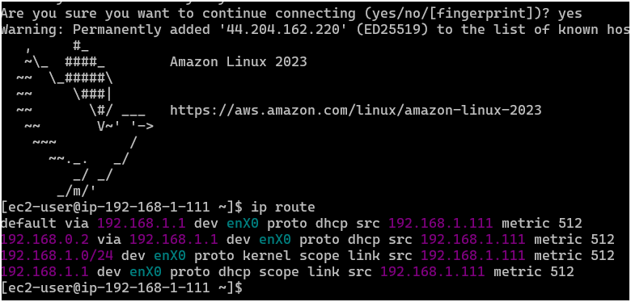

## 📓 LESSONS LEARNED REGISTER 🛜
#### NETWORK ADDRESS TRANSLATION USING INTERNAL PRIVATE IP ADDRESS OF THE INSTANCE

**PROBLEM**: In an attempt to see the ip address of my server in the public subnet using the command ```ip route``` i stumbed on something that wasn't quite what i was expecting. The public ip address of my server in the public subnet is ```public-ip-web-server    : 44.204.162.220``` and the output of the command ```ip route``` gave me this here 



investigations for the interpretation were given as follows;

1. default via ```192.168.1.1``` dev enX0 proto dhcp src ```192.168.1.111``` metric 512
   • This is your default route (for all destinations not specifically listed elsewhere)
   • Traffic is sent via the gateway at ```192.168.1.1```
   • Using network interface enX0
   • The route was learned via DHCP protocol
   • ***Your instance's source IP*** is ```192.168.1.111```
   • Metric 512 is the route priority (lower numbers are preferred)

2. ```192.168.0.2``` via ```192.168.1.1``` dev enX0 proto dhcp src 192.168.1.111 metric 512
   • Traffic to ```192.168.0.2``` specifically is routed via ```192.168.1.1```
   • Using the same interface and source IP
   • Also learned via DHCP

3. ```192.168.1.0/24``` dev enX0 proto kernel scope link src ```192.168.1.111``` metric 512
   • This is a direct route to your ```local subnet (192.168.1.0/24)```
   • Traffic to this subnet goes directly through interface enX0
   • Added by the kernel automatically (proto kernel)
   • "scope link" means it's directly connected
   • Your source IP is 192.168.1.111

4. ```192.168.1.1``` dev enX0 proto dhcp scope link src ```192.168.1.111``` metric 512
   • Specific route to your gateway (192.168.1.1)
   • Directly through interface enX0
   • Learned via DHCP
   • ***Your source IP*** is ```192.168.1.111```

Looking at this explanation, the source ip address of my instance matched the private ip address of my instance in the public subnet. So traffic is somehow routed internally through the private ip address which is referred to as the ```source ip address: 192.168.1.111```
🚀🚀 ```I understood from this```: AWS internally uses the private ip address of the instance which is gotten from one of its ```local subnet (192.168.1.0/24)``` to communicate. There is some differences between the public ip address and the source ip address

### Private IP (192.168.1.111)
• This is your instance's private IP address within your VPC
• It's assigned from the CIDR range of your public subnet (192.168.1.0/24)
• It's only routable within your VPC and connected networks
• This is the IP address that your EC2 instance "knows" about and uses for its network interface
• The ip route command shows this because it's displaying the local routing table from the instance's perspective

### Public IP (44.204.162.220)
• This is your instance's public IP address assigned by AWS
• It's routable on the internet
• Your instance doesn't actually "know" about this IP address
• The translation between your private and public IP happens at the Internet Gateway
• When traffic leaves your VPC, the source IP is translated from 192.168.1.111 to 44.204.162.220
• When traffic returns, the destination IP 44.204.162.220 is translated back to 192.168.1.111

this is how internal network address translation is done using the internal source ip address private to the instance

for resources in the private subnet routing does not happen this way entirely the same. for outbound traffic destined for the internet, the resource in the private subnet attempt to reach the NAT Gatway via its ```elastic (public) ip address```. the NAT GATWAY does not do a secondary translation, it forwards traffic to the internet gateway and then to the internet using this public ip address.

**NOTE**: NAT Gatway has an internal private ip address assigned from the subnet it's deployed in (public subnet). THis is used for communication within your VPC 