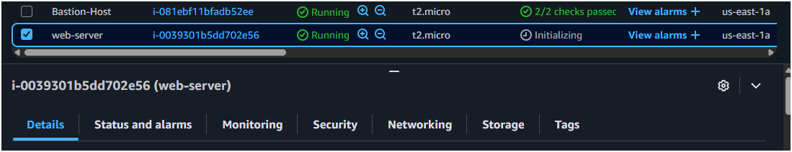
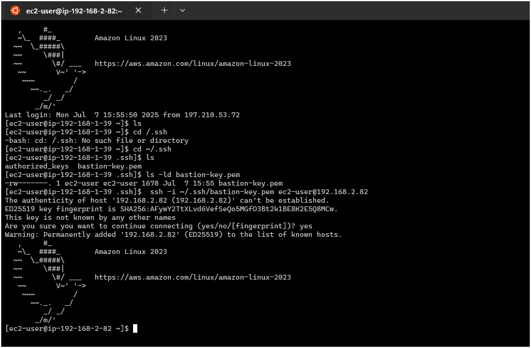

## THREE TIER ARCHITECTURE PROJECT

# WHAT IS A THREE-TIER-ARCHITECTURE

### PRE-REQUISITES

### STEP1 : CREATE A VPC AND SUBNET AS WELL AS ROUTING AND SECURITY GROUPS FOR YOUR WORKLOAD
- Go to “Your VPCs” from the VPC service on the AWS management console and click on the orange “Create VPC” button
- create a vpc here and give it a name. You are free to make your own name or follow along with the one put here. choose ```vpc only```
- Give it a ```192.168.0.0/16``` CIDR block.
- Choose ```No IPv6 CIDR Block``` 
- Leave Tenancy as ```Default```
- optionaly choose a Tag
- click on the orange button to create VPC

**CREATING SUBNETS**
- To create your subnets go to Subnets on the left hand side of the VPC service and click on it
- Add your VPC ID to where it asks ```$(VPC-ID)```
- Assign it a name letting you know what it is your first public subnet ```Public-Subnet```
- Put it in any availability zone ```us-east-1a``` and give it a CIDR of ```192.168.1.0/24```
- leave others as Default and click on create. (This is going to be your public Subnet)
- Add a second subnet and name it ```Private-Subnet-1``` or something to let you know it is your first private subnet
- Put it in the same availability zone ```us-east-1a``` as the first subnet you made and give it a ```subnet-CIDR``` of ```192.168.2.0/24```
- Add a third subnet and assign a name letting you know it is the second private subnet ```Private-subnet-2```you will be making
- Put it in the same availability zone ```us-east-1a``` as your first public subnet and give it a ```subnet-CIDR``` of ```192.168.3.0/24```
- Add a fourth and final subnet and give it a name letting you know it is the third private subnet ```Private-Subnet-3```
- Put it in a **different availability zone**, ```us-east-1b``` from the rest of your subnets ```Private-Subnet-3``` and give it a ```subnet-CIDR``` of ```192.168.4.0/24```

- Default route tables will be setup by AWS to route traffic to the subnets. 
- Allocate an Elastic IP address by going to Elastic IPs on the left hand side and click ```Allocate Elastic IP address```
- Make sure the ```Network-border-group``` is the same as the region you've been creating your resources and Leave all other settings as default then press ```“Allocate”```. You can optionally add a name tag if you wish though this is not necessary

**INTERNET GATEWAY**
- Now create an internet gateway and attach it to the VPC by going to Internet Gateways on the left hand side and clicking ```“Create Internet Gateway”```
- After creating the Internet Gateway, at the upper right corner, click on actions, in the drop-down menu, choose ```Attach VPC``` and select the VPC for your resources, click on the yellow button selecting```Attach Internet Gateway```.


📲**NAT GATEWAY**
- Create a NAT Gateway by clicking on Nat Gateways on the left hand side and then clicking ```Create NAT Gateway```
- Give it a name like this ```my-nat-gateway``` and assign it to a **public subnet** such as ```Public-Subnet```which you created earlier.
- Select ```Connectivity type``` as **Public**
- Click the drop down for Elastic IPs and click the one you created previously.
- Click ```Create NAT gateway```

®️**ROUTE TABLES**
- Create Route Tables by first heading to “Route Tables” on the left hand side
- Click ```Create route table```, Name the route table ```my-route-table```, select the VPC you've been using for your resources and hit the yellow button to ```Create Route table```
- Make a second route table naming it ```Private-route-table``` and assign your VPC to it.
- Now associate your subnets with their respective route table
- Click on the public route table and click on ```Subnet association``` next to “Details”
- Click on ```Edit subnet associations``` and select the ```Public-Subnet``` created, select ```Associate Subnet`` to associate the public route table with the public subnet
- Do same for the private route table, associate it with the private subnets created earlier
- Now add a route to our public route table to get access to the internet gateway
- Click on ```Routes``` next to ```Details``` and click ```Edit routes```
- Add a new route having a destination of anywhere ```0.0.0.0``` and a target of your ```internet gateway``` with your ```Internet-gateway-ID``` and click ```Save changes```
- To edit routes for the private table, Go to edit the routes of the private table
- Add a route to the private table that has a destination of anywhere and a target of your Nat gateway that you made earlier

🔐 **SECURITY GROUPS**
- Now to create our security groups (One for our bastion host, web server, app server, and our database) we will head to Security Groups on the left and click ```Create security group```
- Give it a name and description letting you know it is for a bastion host
- Assign your VPC to it by selecting your VPC-ID in the VPC section
- add the following ```inbound rules``` to the bastion host security group
   ***HTTP: TCP/80 : 0.0.0.0/0 (anywhere)
   HTTPS: TCP/443 : 0.0.0.0/0 (anywhere)
   SSH: TCP/22 : 0.0.0.0/0 (anywhere)***


- Create another security group ```web-server-security-group```
- Give it a description letting you know it is for a Web server
- Assign your VPC to it
- Give it the same inbound rules as the Bastion Host security group


- Create another security group
- Give it a name ```app-server-security-group``` and description letting you know it is for an app server
- Assign your VPC to it
- Give it an inbound rule for All ICMP-IPv4 with a source of your web server SG and another inbound rule for SSH with a source of your bastion host SG
- Create one final security group 
- Give it a name ```db-sg``` description letting you know it is for a database server
- Assign your VPC to it
- Give it two inbound rules both for MYSQL/Aurora and give one of them a source of your app server SG and the other one a source of your bastion host SG


- Go back to your bastion host inbound rules and add one more for MYSQL/Aurora and a source of your database SG
- Go back to your web server inbound rules and add one more for All ICMP - IPv4 and a source of your app server SG
- Go back to your app server inbound rules and add one more for MYSQL/Aurora and a source of your database SG and then an HTTP and HTTPS rule both with a source of 0.0.0.0/0


## Step 2: CREATING SERVERS
- Create The Bastion Host Servers, Go to the Management Console and search for EC2, Go to EC2 Dashboard and select ```Launch Instance```
- Name your EC2 Instance ```Bastion-Host-Server``` or any prefared name you choose
- Select AMI ```AMAZON LINUX 2 AMI``` , and choose the ```t2-micro``` instance type which is free-tier eligible
- edit ```Network Settings```, choose the VPC which you created for the project,
- choose the public subnet as the subnet for the bastion host server and **Enable** ```Auto-Assign-public-IP```
- for the firewall and security group, choose ```select existing security group``` and select the bastion host sg which we created earlier
- leave advanced network configuration, configure storage, and advanced details as default and hit the yellow button ```launch server``` to create the bastion host server


### TESTING OUR BASTION HOST SERVER
 having enabled ssh connections to our bastion host server and also created an inbound rule allowing for ssh communication to bastion host server, retrieve the public ip address of the server and attempt an ssh connection to test for connectivity.
 - use the command
  ```bash 
  ssh -i <key-pair.pem> ec2-user@<public-ip-address-of-server>
  ```
  - terminal output should look like this 🎉🎉🎉🎉
  

  - launch another instane and name it ```web-server```, choose the same AMI as the previous instance, use the **existing** key-pair created for the bastion-host-server,
  - in the network settings, click on ```edit``` and choose the vpc which we created for our project, choose the public subnet same as the bastion host server
  - choose enable to auto-assign-public ip address, select from the ```existing security groups``` the web-server-security-group which we created before
  - leave ```configure storage``` as default
  - expand the  ```advanced details``` section and scroll down to app-data. we will add the following script to the ec2 at launch time
```
#!/bin/bash 
yum update -y
amazon-linux-extras install -y lamp-mariadb10.2-php7.2 php7.2
yum install -y httpd
systemctl start httpd
systemctl enable httpd
```
here is a detailed instruction of what the above commands will do:
1. **#!/bin/bash** - This is called a shebang line that tells the system to use the bash shell interpreter to execute the script.

2. **yum update -y** - Updates all installed packages on the Amazon Linux system to their latest versions. The -y flag automatically answers "yes" to any prompts,
preventing the command from waiting for user input.

3. **amazon-linux-extras install -y lamp-mariadb10.2-php7.2 php7.2** - Installs the LAMP (Linux, Apache, MariaDB, PHP) stack components from the Amazon Linux 
Extras repository. Specifically, it installs MariaDB 10.2 and PHP 7.2. The -y flag automatically confirms all prompts.

4. **yum install -y httpd** - Installs the Apache HTTP server (web server) package. The -y flag automatically confirms the installation without prompting.

5. **systemctl start httpd** - Starts the Apache HTTP server service immediately.

6. **systemctl enable httpd** - Configures the Apache HTTP server to automatically start whenever the system boots up.

__*This script will work properly in EC2 user data without requiring password prompts because EC2 user data scripts run with root privileges during instance 
initialization*__



- test for connectivity to your ec2 instance. follow the previous steps to test for SSH connectivity to the instance. 
- inside the instance you can do the command to see the services you installed running ```systemctl list-units --all | grep httpd```

- you can also attempt to reach the server over the browser using the public ip address of the web-server. This will give you the outcome __**It Works**__


- follow the steps again to create the app-server
- choose the VPC for our Project
- choose the ```Private-subnet-1``` as our subnet, 
- **Disable** ```auto-assign-public-ip-address```
- Bootstrap the instance using this app data script
```bash
#!/bin/bash
sudo yum install -y mariadb-server
sudo service mariadb start 
```
here is a detailed instruction of what the command does
1. sudo yum install -y mariadb-server
   • **sudo:** Executes the command with superuser/administrator privileges
   • **yum:** The package manager used in RHEL-based Linux distributions
   • **install:** The yum subcommand to install packages
   • **-y**: Automatically answers "yes" to any prompts during installation
   • **mariadb-server:** The package name for MariaDB database server

  This command installs the MariaDB database server software on your system. MariaDB is an open-source relational database that's a fork of MySQL.

2. sudo service mariadb start
   • **sudo:** Executes the command with superuser privileges
   • **service:** A command used to run a System V init script
   • **mariadb:** The name of the service to manage
   • **start:** The action to perform on the service

  This command starts the MariaDB database service, making the database server active and ready to accept connections.

After running these commands:
• MariaDB server will be installed on your system
• The MariaDB service will be running
• You can connect to the database using the MySQL client
• By default, the database will be accessible on localhost (127.0.0.1) on port 3306

- Select an existing security group and select the ```app-server-sg```
- Just like before launch and use the existing keypair ```bastion-key.pem```

### connecting to the instance in the private subnet through the bastion host for testing
#### Step 1: 
To securely connect to the app-server in the private subnet via the bastion-host, **firstly** one method we can use is to copy our private keys from our local machine to the bastion-server using the following command
```scp -i /path/to/key-pair.pem /path/to/key-pair.pem ec2-user@<bastion-host-public-ip>:~/.ssh/```

• scp: Secure Copy Protocol command, used for transferring files between hosts
• -i /path/to/key-pair.pem: Specifies the identity file (private key) to use for authenticating to the bastion host, replace ```/path/to/key-pair.pem``` with the actual path to your key file (e.g., ~/.ssh/bastion-key.pem)
• /path/to/key-pair.pem: The source file you want to copy (your private key file). This is the same key file you're using for authentication
• ec2-user@<bastion-host-public-ip>: The username and public IP address of the bastion host replace ```<bastion-host-public-ip>``` with the actual public IP (e.g., 54.123.45.67)
• :~/.ssh/: The destination directory on the bastion host where the file will be copied, ```~/.ssh/``` refers to the .ssh directory in the home directory of the ec2-user

__*note*__ Ensure to set your key.pem file with the right permissions ```400``` or  ```600``` is ok for this purpose, so ```chmod 400 key.pem```
see here!!


### Step 2:
connect to the private instance (app-server) in the private subnet from the bastion host with the command ``` ssh -i ~/.ssh/key-pair.pem ec2-user@<private-instance-private-ip>```
we connected to our private server on ip address 192.168.2.82 from our bastion host server on 192.218.53.72 🎉🎉🎉



##  Step 3: Create a Database
- Create a DB subnet group by first heading to the Amazon RDS service page on the AWS management console
- Click on Subnet Groups on the left hand side and the click on ```Create DB subnet group```
- ●Give it a ```name``` and ```description``` letting you know what it is and then assign your VPC to it
- Put in the ```availability zones``` you used for your subnets
- Select subnets 3 and 4


- Go to Databases on the left hand side and click on ```Create Database```
- Click on ```Standard create``` and ```MariaDB``` for the engine type
- choose free tier
- Give it an ```identifier``` you can easily identify it with
- Give it a ```master username``` or leave it as default admin. For the purpose of these instructions I will be using ```root```
- Give it a ```password``` that you write down somewhere else to make sure you have the correct on
- Assign your ```vpc``` which you created for this project
- Choose your subnet group listed under the subnet group section
- Public access is **NO**
- Choose existing VPC security groups
- **Remove** the ```default security group``` and add your ```database security group```
- Select your first ```availability zone``` as well
- Scroll down to Additional configuration on the bottom and give it an ```initial database name``` and save it in the same spot as your password since it will be used later
- ```Disable automated backups and encryption``` since they are not needed (These are normally best practice to leave enabled but the database will spin up faster with those checked off as they are not needed).
- Scroll down all the way to the bottom and ```create``` your database

## TESTING CONNECTIVITY TO DATABASE
- To Connect to the database, ssh into the bastion server, and from the bastion server, ssh into the app-server where you have mariadb-server installed.
- Test out connecting to the database by typing out ```mysql –user=<your-db-user> -password=<your-db-password> –host=<database-server-endpoint>```
- Replace database-server-endpoint with the database server endpoint 
- Type ```show databases;``` to see your database from the app server