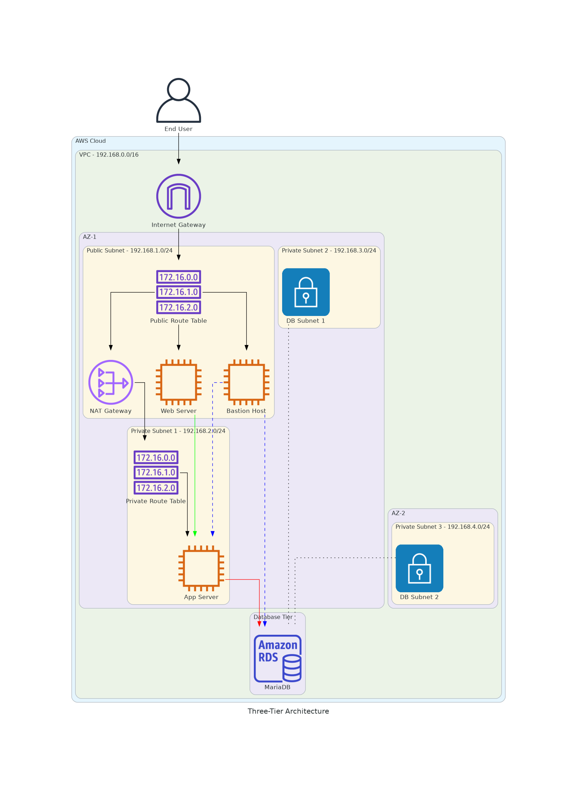
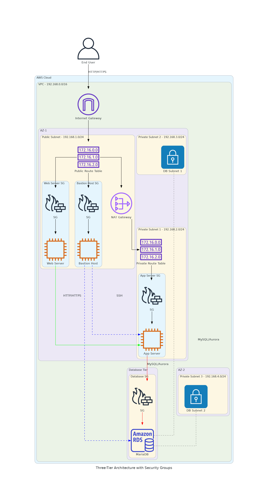

# Three-Tier Architecture CloudFormation Template

This CloudFormation template deploys a complete three-tier architecture on AWS, consisting of:

1. **Presentation Tier (Web Tier)**
   - Web server in a public subnet
   - Bastion host for secure access to private resources

2. **Application Tier (Logic Tier)**
   - Application server in a private subnet
   - Protected by security groups

3. **Data Tier (Database Tier)**
   - MariaDB RDS instance in private subnets
   - Multi-AZ capability for high availability

## Architecture Overview



The architecture includes:

- VPC with public and private subnets across multiple Availability Zones
- Internet Gateway for public internet access
- NAT Gateway for private subnets to access the internet
- Route tables to control traffic flow
- Security groups for access control
- EC2 instances for web, application, and bastion hosts
- RDS instance for the database

## Security Groups Configuration



The template configures the following security groups:

1. **Bastion Host Security Group**
   - Allows inbound HTTP (80), HTTPS (443), and SSH (22) from anywhere
   - Allows MySQL/Aurora (3306) from the Database Security Group

2. **Web Server Security Group**
   - Allows inbound HTTP (80), HTTPS (443), and SSH (22) from anywhere
   - Allows ICMP from the App Server Security Group

3. **App Server Security Group**
   - Allows ICMP from the Web Server Security Group
   - Allows SSH (22) from the Bastion Host Security Group
   - Allows HTTP (80) and HTTPS (443) from anywhere
   - Allows MySQL/Aurora (3306) from the Database Security Group

4. **Database Security Group**
   - Allows MySQL/Aurora (3306) from the App Server Security Group
   - Allows MySQL/Aurora (3306) from the Bastion Host Security Group

## Deployment Instructions

1. Ensure you have the necessary permissions to create all resources
2. Create or identify an EC2 key pair for SSH access
3. Deploy the CloudFormation template using the AWS Management Console or AWS CLI
4. Provide the required parameters (see [cloudformation.md](cloudformation.md) for details)
5. Wait for the stack creation to complete
6. Access the outputs to get connection information

## Accessing Resources

- **Web Server**: Access via the public IP address or SSH
- **App Server**: SSH to the Bastion Host first, then SSH to the App Server using its private IP
- **Database**: Connect from the App Server or Bastion Host using the database endpoint

## Testing Connectivity

1. **Web Server**: Access via browser using the WebServerURL output
2. **App Server**: SSH from the Bastion Host using:
   ```
   ssh -i ~/.ssh/key-pair.pem ec2-user@<AppServerPrivateIP>
   ```
3. **Database**: From the App Server, run the test script:
   ```
   /home/ec2-user/test-db-connection.sh
   ```

## Customization

The template includes parameters for customizing:
- Environment name
- Network CIDR ranges
- Instance types
- Database configuration
- Multi-AZ deployment

See [cloudformation.md](cloudformation.md) for a complete list of parameters and their descriptions.

## Clean Up

To avoid incurring charges, delete the CloudFormation stack when resources are no longer needed:

1. Go to the AWS CloudFormation console
2. Select the stack
3. Click "Delete" and confirm the deletion
4. Wait for all resources to be deleted
