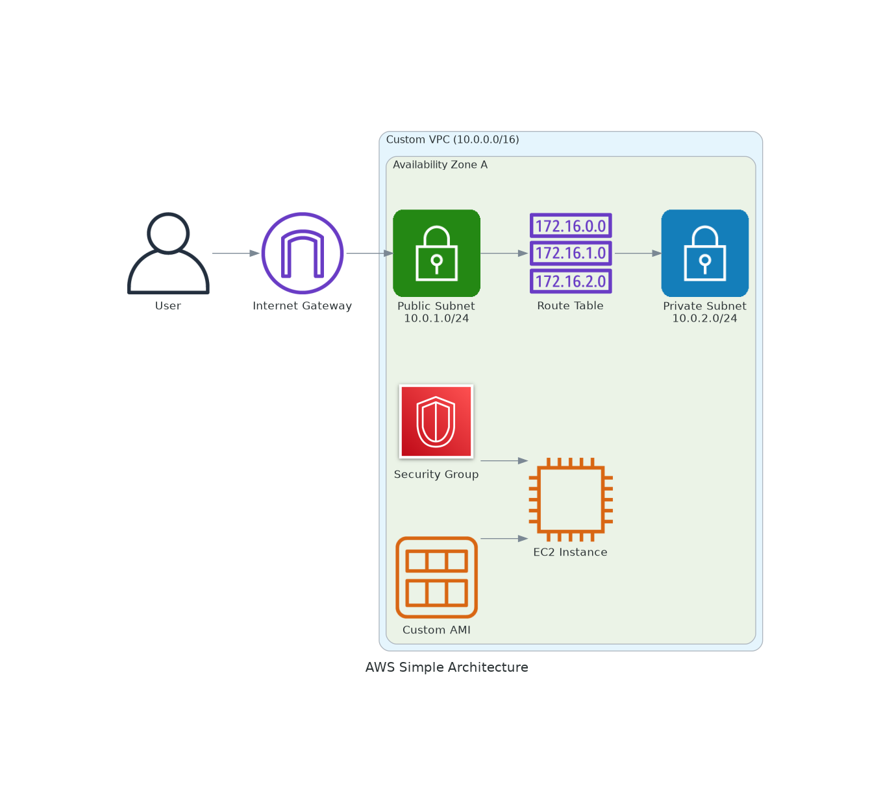

# AWS Infrastructure Provisioning with AWS CLI

This project demonstrates how to provision a complete AWS infrastructure using AWS CLI commands. The architecture includes a custom VPC, subnets, internet gateway, route table, security group, custom AMI, and EC2 instance.

## Architecture Overview



### Components:
- **Custom VPC**: Isolated network environment (10.0.0.0/16)
- **Availability Zone**: Single AZ deployment for simplicity
- **Public Subnet**: Internet-accessible subnet (10.0.1.0/24)
- **Private Subnet**: Internal subnet (10.0.2.0/24)
- **Internet Gateway**: Provides internet access to public subnet
- **Route Table**: Routes traffic between subnets and internet
- **Security Group**: Firewall rules for EC2 instance
- **Custom AMI**: Pre-configured machine image
- **EC2 Instance**: Virtual server launched from custom AMI

## Prerequisites

### 1. AWS CLI Installation
```bash
# Install AWS CLI v2 (Linux)
curl "https://awscli.amazonaws.com/awscli-exe-linux-x86_64.zip" -o "awscliv2.zip"
unzip awscliv2.zip
sudo ./aws/install

# Verify installation
aws --version
```

### 2. AWS Credentials Configuration
```bash
# Configure AWS credentials
aws configure

# You'll be prompted for:
# AWS Access Key ID: [Your Access Key]
# AWS Secret Access Key: [Your Secret Key]
# Default region name: us-east-1
# Default output format: json
```

### 3. Required Permissions
Your AWS user/role needs the following permissions:
- EC2FullAccess (or specific EC2 permissions)
- VPCFullAccess (or specific VPC permissions)

## Project Structure

```
cli-scripts/
├── variables.sh          # Configuration variables
├── 01-create-vpc.sh      # Create VPC
├── 02-create-subnets.sh  # Create public and private subnets
├── 03-create-igw.sh      # Create and attach internet gateway
├── 04-create-route-table.sh # Create and configure route table
├── 05-create-security-group.sh # Create security group with rules
├── 06-create-ami.sh      # Create custom AMI from existing instance
├── 07-launch-ec2.sh      # Launch EC2 instance from AMI
└── cleanup.sh            # Clean up all resources
```

## Step-by-Step Deployment

### Step 1: Set Up Variables
First, let's configure our project variables:

```bash
cd cli-scripts
chmod +x *.sh
source variables.sh
```

### Step 2: Create VPC
```bash
./01-create-vpc.sh
```
**What this does:**
- Creates a custom VPC with CIDR block 10.0.0.0/16
- Enables DNS hostnames and DNS resolution
- Tags the VPC for easy identification

### Step 3: Create Subnets
```bash
./02-create-subnets.sh
```
**What this does:**
- Creates a public subnet (10.0.1.0/24) in the first AZ
- Creates a private subnet (10.0.2.0/24) in the same AZ
- Enables auto-assign public IP for the public subnet

### Step 4: Create Internet Gateway
```bash
./03-create-igw.sh
```
**What this does:**
- Creates an internet gateway
- Attaches it to the VPC
- Enables internet connectivity for the VPC

### Step 5: Configure Route Table
```bash
./04-create-route-table.sh
```
**What this does:**
- Creates a custom route table
- Adds a route to the internet gateway (0.0.0.0/0)
- Associates the public subnet with the route table

### Step 6: Create Security Group
```bash
./05-create-security-group.sh
```
**What this does:**
- Creates a security group in the VPC
- Adds inbound rules for SSH (port 22) and HTTP (port 80)
- Allows all outbound traffic

### Step 7: Create Custom AMI
```bash
./06-create-ami.sh
```
**What this does:**
- Launches a temporary EC2 instance
- Installs and configures software (Apache web server)
- Creates an AMI from the configured instance
- Terminates the temporary instance

### Step 8: Launch EC2 Instance
```bash
./07-launch-ec2.sh
```
**What this does:**
- Launches an EC2 instance using the custom AMI
- Places it in the public subnet
- Assigns the security group
- Uses your specified key pair for SSH access

## Complete Deployment (All Steps)
To run all steps in sequence:

```bash
cd cli-scripts
chmod +x *.sh

# Source variables
source variables.sh

# Run all deployment scripts
./01-create-vpc.sh && \
./02-create-subnets.sh && \
./03-create-igw.sh && \
./04-create-route-table.sh && \
./05-create-security-group.sh && \
./06-create-ami.sh && \
./07-launch-ec2.sh

echo "Deployment complete! Check AWS Console for resources."
```

## Verification

### 1. Check VPC
```bash
aws ec2 describe-vpcs --vpc-ids $VPC_ID --query 'Vpcs[0].{VpcId:VpcId,CidrBlock:CidrBlock,State:State}'
```

### 2. Check Subnets
```bash
aws ec2 describe-subnets --filters "Name=vpc-id,Values=$VPC_ID" --query 'Subnets[*].{SubnetId:SubnetId,CidrBlock:CidrBlock,AvailabilityZone:AvailabilityZone}'
```

### 3. Check EC2 Instance
```bash
aws ec2 describe-instances --instance-ids $INSTANCE_ID --query 'Reservations[0].Instances[0].{InstanceId:InstanceId,State:State.Name,PublicIp:PublicIpAddress}'
```

### 4. Test Web Server (if AMI includes web server)
```bash
# Get the public IP
PUBLIC_IP=$(aws ec2 describe-instances --instance-ids $INSTANCE_ID --query 'Reservations[0].Instances[0].PublicIpAddress' --output text)

# Test HTTP connection
curl http://$PUBLIC_IP
```

## Connecting to Your Instance

### SSH Connection
```bash
# Get the public IP address
PUBLIC_IP=$(aws ec2 describe-instances --instance-ids $INSTANCE_ID --query 'Reservations[0].Instances[0].PublicIpAddress' --output text)

# Connect via SSH (replace 'your-key.pem' with your actual key file)
ssh -i ~/.ssh/your-key.pem ec2-user@$PUBLIC_IP
```

## Cost Considerations

**Estimated Monthly Costs (us-east-1):**
- VPC, Subnets, IGW, Route Tables: **Free**
- Security Groups: **Free**
- AMI Storage: **~$0.05/month** (for 8GB EBS snapshot)
- EC2 t2.micro instance: **~$8.50/month** (if not in free tier)
- Data Transfer: **First 1GB free, then $0.09/GB**

**Free Tier Benefits:**
- 750 hours/month of t2.micro instances (first 12 months)
- 30GB of EBS storage
- 1GB of data transfer out

## Cleanup

To avoid ongoing charges, clean up all resources:

```bash
./cleanup.sh
```

**Manual Cleanup (if script fails):**
```bash
# Terminate EC2 instance
aws ec2 terminate-instances --instance-ids $INSTANCE_ID

# Wait for termination
aws ec2 wait instance-terminated --instance-ids $INSTANCE_ID

# Deregister AMI
aws ec2 deregister-image --image-id $AMI_ID

# Delete snapshot
aws ec2 delete-snapshot --snapshot-id $SNAPSHOT_ID

# Delete security group
aws ec2 delete-security-group --group-id $SECURITY_GROUP_ID

# Detach and delete internet gateway
aws ec2 detach-internet-gateway --internet-gateway-id $IGW_ID --vpc-id $VPC_ID
aws ec2 delete-internet-gateway --internet-gateway-id $IGW_ID

# Delete route table (if not main)
aws ec2 delete-route-table --route-table-id $ROUTE_TABLE_ID

# Delete subnets
aws ec2 delete-subnet --subnet-id $PUBLIC_SUBNET_ID
aws ec2 delete-subnet --subnet-id $PRIVATE_SUBNET_ID

# Delete VPC
aws ec2 delete-vpc --vpc-id $VPC_ID
```

## Troubleshooting

### Common Issues:

1. **"InvalidKeyPair.NotFound" Error**
   ```bash
   # List available key pairs
   aws ec2 describe-key-pairs
   
   # Create a new key pair if needed
   aws ec2 create-key-pair --key-name MyKeyPair --query 'KeyMaterial' --output text > MyKeyPair.pem
   chmod 400 MyKeyPair.pem
   ```

2. **"UnauthorizedOperation" Error**
   - Check your AWS credentials and permissions
   - Ensure your user has EC2 and VPC permissions

3. **"InvalidAMI.NotFound" Error**
   - Verify the AMI ID exists in your region
   - Check if the AMI creation completed successfully

4. **Instance Launch Fails**
   ```bash
   # Check instance status
   aws ec2 describe-instance-status --instance-ids $INSTANCE_ID
   
   # Check system logs
   aws ec2 get-console-output --instance-id $INSTANCE_ID
   ```

5. **Cannot Connect via SSH**
   - Verify security group allows SSH (port 22)
   - Check if instance has public IP
   - Ensure key pair permissions are correct (chmod 400)

### Useful Commands:

```bash
# List all VPCs
aws ec2 describe-vpcs --query 'Vpcs[*].{VpcId:VpcId,CidrBlock:CidrBlock,IsDefault:IsDefault}'

# List all instances
aws ec2 describe-instances --query 'Reservations[*].Instances[*].{InstanceId:InstanceId,State:State.Name,Type:InstanceType}'

# Check AWS CLI configuration
aws configure list

# Get current region
aws configure get region

# List available regions
aws ec2 describe-regions --query 'Regions[*].RegionName'
```

## Next Steps

After completing this basic setup, consider:

1. **Add NAT Gateway** for private subnet internet access
2. **Implement Auto Scaling** for high availability
3. **Add Application Load Balancer** for traffic distribution
4. **Set up CloudWatch monitoring** for observability
5. **Implement backup strategies** for data protection
6. **Add multiple AZs** for fault tolerance

## Learning Resources

- [AWS CLI User Guide](https://docs.aws.amazon.com/cli/latest/userguide/)
- [AWS VPC User Guide](https://docs.aws.amazon.com/vpc/latest/userguide/)
- [AWS EC2 User Guide](https://docs.aws.amazon.com/AWSEC2/latest/UserGuide/)
- [AWS Well-Architected Framework](https://aws.amazon.com/architecture/well-architected/)

## Support

If you encounter issues:
1. Check the troubleshooting section above
2. Review AWS CloudTrail logs for API call details
3. Consult AWS documentation
4. Use AWS Support (if you have a support plan)
