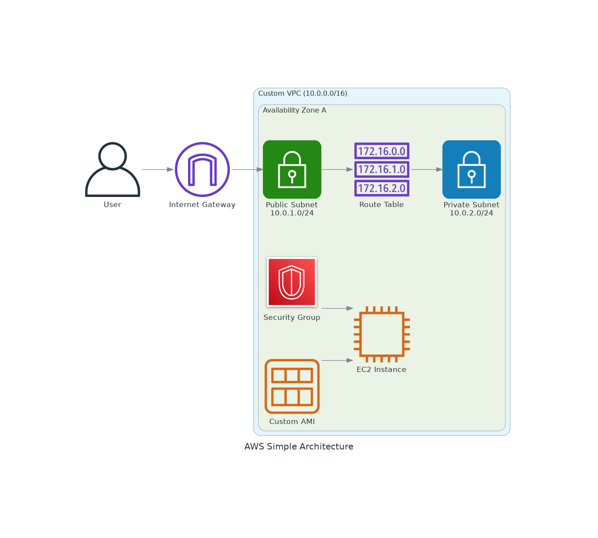

# AWS Infrastructure with Terraform

This project demonstrates Infrastructure as Code (IaC) using Terraform to provision the same AWS architecture created with AWS CLI. Terraform provides declarative configuration, state management, and easier resource lifecycle management.

## Architecture Overview



### Components Managed by Terraform:
- **Custom VPC**: Isolated network environment with DNS support
- **Availability Zone**: Single AZ deployment
- **Public Subnet**: Internet-accessible subnet with auto-assign public IP
- **Private Subnet**: Internal subnet for backend resources
- **Internet Gateway**: Provides internet connectivity
- **Route Table**: Custom routing for public subnet
- **Security Group**: Firewall rules for EC2 instances
- **Custom AMI**: Pre-configured Amazon Linux 2 with Apache
- **EC2 Instance**: Web server launched from custom AMI

## Prerequisites

### 1. Terraform Installation

**Linux/macOS:**
```bash
# Download and install Terraform
wget https://releases.hashicorp.com/terraform/1.6.0/terraform_1.6.0_linux_amd64.zip
unzip terraform_1.6.0_linux_amd64.zip
sudo mv terraform /usr/local/bin/

# Verify installation
terraform version
```

**Windows:**
```powershell
# Using Chocolatey
choco install terraform

# Or download from https://www.terraform.io/downloads.html
```

### 2. AWS CLI Configuration
```bash
# Configure AWS credentials (same as CLI project)
aws configure

# Verify configuration
aws sts get-caller-identity
```

### 3. Required Permissions
Your AWS user/role needs:
- EC2FullAccess (or specific EC2 permissions)
- VPCFullAccess (or specific VPC permissions)

## Project Structure

```
terraform/
├── main.tf                 # Main Terraform configuration
├── variables.tf            # Input variables definition
├── outputs.tf              # Output values
├── vpc.tf                  # VPC and networking resources
├── subnets.tf              # Subnet configurations
├── security.tf             # Security groups and rules
├── compute.tf              # EC2 and AMI resources
├── terraform.tfvars.example # Example variables file
├── .terraform/             # Terraform working directory (auto-generated)
├── terraform.tfstate       # Terraform state file (auto-generated)
└── terraform.tfstate.backup # State backup (auto-generated)
```

## Quick Start

### 1. Initialize Terraform
```bash
cd terraform
terraform init
```

### 2. Configure Variables
```bash
# Copy example variables file
cp terraform.tfvars.example terraform.tfvars

# Edit variables (required)
nano terraform.tfvars
```

### 3. Plan Deployment
```bash
# Review what will be created
terraform plan
```

### 4. Deploy Infrastructure
```bash
# Apply configuration
terraform apply

# Type 'yes' when prompted
```

### 5. Access Your Infrastructure
```bash
# Get outputs
terraform output

# Access web server (use the public_ip output)
curl http://$(terraform output -raw instance_public_ip)
```

## Detailed Configuration

### Variables Configuration

Create `terraform.tfvars` file:

```hcl
# Project Configuration
project_name = "aws-simple-architecture"
environment  = "dev"
owner        = "your-name"

# AWS Configuration
aws_region = "us-east-1"

# Network Configuration
vpc_cidr            = "10.0.0.0/16"
public_subnet_cidr  = "10.0.1.0/24"
private_subnet_cidr = "10.0.2.0/24"

# EC2 Configuration
instance_type = "t2.micro"
key_pair_name = "your-key-pair-name"  # REQUIRED: Change this!

# Optional: Restrict SSH access to your IP
# allowed_ssh_cidr = "YOUR.IP.ADDRESS/32"
```

### Key Pair Setup

**Create a new key pair:**
```bash
# Create key pair
aws ec2 create-key-pair \
    --key-name my-terraform-key \
    --query 'KeyMaterial' \
    --output text > ~/.ssh/my-terraform-key.pem

# Set permissions
chmod 400 ~/.ssh/my-terraform-key.pem

# Update terraform.tfvars
echo 'key_pair_name = "my-terraform-key"' >> terraform.tfvars
```

## Terraform Commands Reference

### Basic Operations
```bash
# Initialize working directory
terraform init

# Format configuration files
terraform fmt

# Validate configuration
terraform validate

# Plan changes
terraform plan

# Apply changes
terraform apply

# Destroy infrastructure
terraform destroy
```

### Advanced Operations
```bash
# Plan with variable file
terraform plan -var-file="production.tfvars"

# Apply specific resources
terraform apply -target=aws_instance.web_server

# Import existing resource
terraform import aws_instance.web_server i-1234567890abcdef0

# Show current state
terraform show

# List resources in state
terraform state list

# Refresh state
terraform refresh
```

### State Management
```bash
# Show state
terraform state show aws_instance.web_server

# Move resource in state
terraform state mv aws_instance.old aws_instance.new

# Remove resource from state
terraform state rm aws_instance.web_server

# Pull remote state
terraform state pull
```

## File Descriptions

### main.tf
Main configuration file that:
- Defines the AWS provider
- Sets up data sources for AMI and availability zones
- Configures provider settings and required versions

### variables.tf
Defines all input variables:
- Project metadata (name, environment, owner)
- AWS configuration (region)
- Network settings (CIDR blocks)
- EC2 settings (instance type, key pair)
- Security settings (allowed IP ranges)

### outputs.tf
Defines output values:
- VPC and subnet IDs
- Instance details (ID, public/private IPs)
- Security group ID
- Connection information

### vpc.tf
VPC and networking resources:
- VPC with DNS support
- Internet Gateway
- Route tables and associations

### subnets.tf
Subnet configurations:
- Public subnet with auto-assign public IP
- Private subnet for backend resources
- Proper availability zone placement

### security.tf
Security configurations:
- Security group with HTTP/HTTPS/SSH rules
- Configurable SSH access restrictions
- Outbound traffic rules

### compute.tf
Compute resources:
- Data source for latest Amazon Linux 2 AMI
- EC2 instance configuration
- User data script for web server setup

## Terraform State

### Local State (Default)
- State stored in `terraform.tfstate` file
- Backup created automatically
- **Warning**: Don't commit state files to version control

### Remote State (Recommended for Teams)
```hcl
# backend.tf
terraform {
  backend "s3" {
    bucket = "your-terraform-state-bucket"
    key    = "aws-simple-architecture/terraform.tfstate"
    region = "us-east-1"
    
    # Optional: State locking with DynamoDB
    dynamodb_table = "terraform-state-locks"
    encrypt        = true
  }
}
```

## Environment Management

### Multiple Environments
```bash
# Development
terraform workspace new dev
terraform workspace select dev
terraform apply -var-file="dev.tfvars"

# Production
terraform workspace new prod
terraform workspace select prod
terraform apply -var-file="prod.tfvars"

# List workspaces
terraform workspace list
```

### Environment-Specific Variables
```bash
# dev.tfvars
environment = "dev"
instance_type = "t2.micro"

# prod.tfvars
environment = "prod"
instance_type = "t3.small"
```

## Verification and Testing

### Infrastructure Verification
```bash
# Check all resources
terraform state list

# Verify VPC
aws ec2 describe-vpcs --vpc-ids $(terraform output -raw vpc_id)

# Verify instance
aws ec2 describe-instances --instance-ids $(terraform output -raw instance_id)

# Test web server
curl http://$(terraform output -raw instance_public_ip)
```

### Terraform Validation
```bash
# Validate syntax
terraform validate

# Check formatting
terraform fmt -check

# Security scanning (using tfsec)
tfsec .

# Cost estimation (using infracost)
infracost breakdown --path .
```

## Troubleshooting

### Common Issues

1. **"No valid credential sources found"**
   ```bash
   # Check AWS credentials
   aws sts get-caller-identity
   
   # Reconfigure if needed
   aws configure
   ```

2. **"InvalidKeyPair.NotFound"**
   ```bash
   # List available key pairs
   aws ec2 describe-key-pairs
   
   # Update terraform.tfvars with correct key name
   ```

3. **"Resource already exists"**
   ```bash
   # Import existing resource
   terraform import aws_vpc.main vpc-12345678
   
   # Or use different names/regions
   ```

4. **State Lock Issues**
   ```bash
   # Force unlock (use carefully)
   terraform force-unlock LOCK_ID
   ```

5. **Instance Launch Failures**
   ```bash
   # Check logs
   terraform show
   
   # Verify AMI availability
   aws ec2 describe-images --image-ids ami-12345678
   ```

### Debugging
```bash
# Enable debug logging
export TF_LOG=DEBUG
terraform apply

# Trace specific operations
export TF_LOG=TRACE
terraform plan

# Log to file
export TF_LOG_PATH=./terraform.log
```

## Best Practices

### Security
- Never commit `terraform.tfvars` with sensitive data
- Use AWS IAM roles instead of access keys when possible
- Restrict security group rules to minimum required access
- Enable encryption for state files
- Use separate AWS accounts for different environments

### Code Organization
```bash
# Use consistent naming
resource "aws_instance" "web_server" {
  # Use descriptive names
}

# Group related resources
# vpc.tf - networking
# security.tf - security groups
# compute.tf - EC2 instances
```

### State Management
- Use remote state for team collaboration
- Enable state locking to prevent conflicts
- Regular state backups
- Never edit state files manually

### Version Control
```bash
# .gitignore
*.tfstate
*.tfstate.*
.terraform/
*.tfvars
crash.log
```

## Cost Optimization

### Resource Sizing
```hcl
# Use appropriate instance types
variable "instance_type" {
  description = "EC2 instance type"
  type        = string
  default     = "t2.micro"  # Free tier eligible
}
```

### Tagging Strategy
```hcl
# Consistent tagging for cost tracking
locals {
  common_tags = {
    Project     = var.project_name
    Environment = var.environment
    Owner       = var.owner
    ManagedBy   = "Terraform"
  }
}
```

### Cleanup
```bash
# Always destroy when done
terraform destroy

# Verify cleanup
aws ec2 describe-instances --filters "Name=tag:Project,Values=aws-simple-architecture"
```

## Advanced Features

### Modules
```hcl
# modules/vpc/main.tf
module "vpc" {
  source = "./modules/vpc"
  
  vpc_cidr = var.vpc_cidr
  project_name = var.project_name
}
```

### Conditional Resources
```hcl
# Create NAT Gateway only in production
resource "aws_nat_gateway" "main" {
  count = var.environment == "prod" ? 1 : 0
  
  allocation_id = aws_eip.nat[0].id
  subnet_id     = aws_subnet.public.id
}
```

### Data Sources
```hcl
# Use existing resources
data "aws_vpc" "existing" {
  filter {
    name   = "tag:Name"
    values = ["existing-vpc"]
  }
}
```

## Migration from CLI

### Import Existing Resources
```bash
# Import VPC
terraform import aws_vpc.main vpc-12345678

# Import instance
terraform import aws_instance.web_server i-1234567890abcdef0

# Generate configuration
terraform show -no-color > imported.tf
```

### State Migration
```bash
# From CLI-created resources to Terraform
# 1. Create Terraform configuration
# 2. Import resources one by one
# 3. Run terraform plan to verify
# 4. Apply any differences
```

## Monitoring and Observability

### CloudWatch Integration
```hcl
# CloudWatch alarms
resource "aws_cloudwatch_metric_alarm" "high_cpu" {
  alarm_name          = "${var.project_name}-high-cpu"
  comparison_operator = "GreaterThanThreshold"
  evaluation_periods  = "2"
  metric_name         = "CPUUtilization"
  namespace           = "AWS/EC2"
  period              = "120"
  statistic           = "Average"
  threshold           = "80"
  alarm_description   = "This metric monitors ec2 cpu utilization"
  
  dimensions = {
    InstanceId = aws_instance.web_server.id
  }
}
```

### Outputs for Monitoring
```hcl
output "monitoring_urls" {
  description = "URLs for monitoring"
  value = {
    cloudwatch = "https://console.aws.amazon.com/cloudwatch/home?region=${var.aws_region}#metricsV2:graph=~()"
    ec2_console = "https://console.aws.amazon.com/ec2/v2/home?region=${var.aws_region}#Instances:instanceId=${aws_instance.web_server.id}"
  }
}
```

## Next Steps

After mastering this basic setup:

1. **Add Auto Scaling**: Implement Auto Scaling Groups
2. **Load Balancing**: Add Application Load Balancer
3. **Database**: Add RDS instance in private subnet
4. **Monitoring**: Implement CloudWatch dashboards
5. **CI/CD**: Integrate with GitHub Actions or GitLab CI
6. **Security**: Add AWS Config rules and GuardDuty
7. **Backup**: Implement automated backup strategies

## Learning Resources

- [Terraform Documentation](https://www.terraform.io/docs/)
- [AWS Provider Documentation](https://registry.terraform.io/providers/hashicorp/aws/latest/docs)
- [Terraform Best Practices](https://www.terraform-best-practices.com/)
- [AWS Well-Architected Framework](https://aws.amazon.com/architecture/well-architected/)

## Support and Community

- [Terraform Community Forum](https://discuss.hashicorp.com/c/terraform-core/)
- [AWS Community Forums](https://forums.aws.amazon.com/)
- [Terraform GitHub Issues](https://github.com/hashicorp/terraform/issues)

## Comparison: CLI vs Terraform

| Aspect | AWS CLI | Terraform |
|--------|---------|-----------|
| **Learning Curve** | Moderate | Steeper initially |
| **State Management** | Manual tracking | Automatic state tracking |
| **Idempotency** | Manual checks needed | Built-in |
| **Rollback** | Manual process | `terraform destroy` |
| **Team Collaboration** | Difficult | Excellent with remote state |
| **Documentation** | Scripts as documentation | Configuration as documentation |
| **Dependency Management** | Manual ordering | Automatic dependency resolution |
| **Error Handling** | Manual error checking | Built-in validation |
| **Reusability** | Copy/modify scripts | Modules and variables |
| **Version Control** | Script versioning | Configuration + state versioning |

Choose Terraform for:
- Team environments
- Complex infrastructure
- Frequent changes
- Production workloads

Choose CLI for:
- Learning AWS services
- One-off tasks
- Simple automation
- Debugging and troubleshooting
