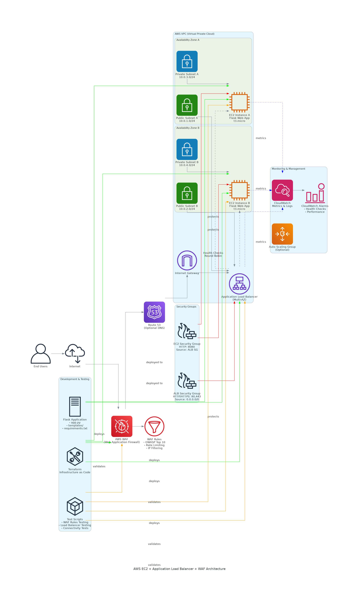

# AWS EC2 + Application Load Balancer + WAF Demo

This project demonstrates a complete AWS architecture using:
- **EC2 instances** running a simple web application
- **Application Load Balancer (ALB)** for traffic distribution
- **AWS WAF** for web application firewall protection
- **Testing tools** to verify functionality

## Architecture Overview

```
Internet → WAF → Application Load Balancer → EC2 Instances (Multi-AZ)
```


## Components

1. **VPC with Public/Private Subnets** - Network foundation
2. **EC2 Instances** - Web servers in multiple availability zones
3. **Application Load Balancer** - Distributes traffic across EC2 instances
4. **AWS WAF** - Protects against common web exploits
5. **Security Groups** - Network-level security
6. **Testing Scripts** - Validate WAF rules and load balancing

## Project Structure

```
aws-ec2-lb-waf/
├── flask-app/                 # Web application for testing
│   ├── app.py                # Flask application
│   ├── run.py                # Application runner
│   ├── requirements.txt      # Python dependencies
│   ├── templates/            # HTML templates
│   └── README.md            # Flask app documentation
├── infrastructure/           # Terraform infrastructure code
│   ├── vpc.tf               # VPC, subnets, gateways
│   ├── security-groups.tf   # Security group rules
│   ├── ec2.tf               # EC2 instances and user data
│   ├── load-balancer.tf     # ALB configuration
│   ├── waf.tf               # WAF rules and associations
│   ├── outputs.tf           # Output values
│   └── variables.tf         # Input variables
├── scripts/                  # Utility and deployment scripts
│   ├── user-data.sh         # EC2 initialization script
│   └── test-setup.py        # Testing and validation script
├── tests/                    # Test suites
│   ├── test-waf-rules.py    # WAF rule testing
│   ├── test-load-balancer.py # Load balancer testing
│   └── test-connectivity.py # General connectivity tests
├── local-run-README.md      # Local development guide
└── mgt-console-README.md    # AWS Management Console guide
```

## Quick Start

### Local Development

For local testing and development:

**Option 1: Quick Start (Recommended)**
```bash
# Navigate to project directory
cd aws-ec2-lb-waf

# Run the startup script
./start-local.sh
```

**Option 2: Manual Setup**
```bash
# Create and activate virtual environment
python3 -m venv aws-ec2-venv
source aws-ec2-venv/bin/activate

# Install dependencies and run locally
cd flask-app
pip install -r requirements.txt
python app.py
```

Visit http://localhost:8080 to access the application.

📖 **For detailed local development instructions, see [local-run-README.md](local-run-README.md)**

### AWS Deployment

1. **Deploy Infrastructure**:
   ```bash
   cd infrastructure/
   terraform init
   terraform plan
   terraform apply
   ```

2. **Run Tests**:
   ```bash
   cd scripts/
   python test-setup.py
   ```

3. **Test WAF Protection**:
   ```bash
   cd tests/
   python test-waf-rules.py
   ```

## Features Demonstrated

- **High Availability**: Multi-AZ deployment
- **Security**: WAF protection against OWASP Top 10
- **Load Distribution**: Round-robin traffic distribution
- **Health Checks**: Automatic unhealthy instance detection
- **Monitoring**: CloudWatch integration
- **Testing**: Comprehensive test suite

## Prerequisites

- AWS CLI configured
- Terraform installed
- Python 3.x with requests library
- Valid AWS credentials with appropriate permissions
