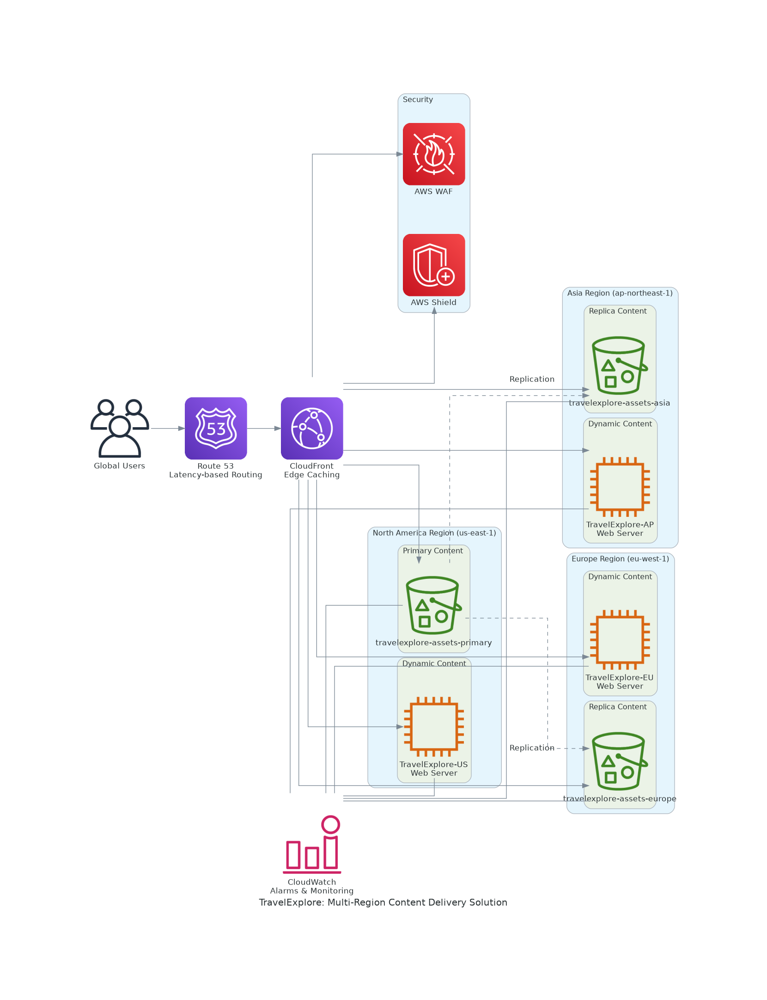

# TravelExplore: Multi-Region Content Delivery Solution

## Project Overview

TravelExplore is a global travel agency that needs to deliver content-rich travel guides to users worldwide with minimal latency. This project implements a hybrid architecture using both S3 and EC2 to provide an optimal solution for serving static and dynamic content.

## Business Requirements

1. **Global Content Delivery**: Serve content to users in North America, Europe, and Asia with minimal latency
2. **Cost-Effective Storage**: Efficiently store and serve large media files (high-resolution images, PDFs)
3. **Frequent Content Updates**: Allow content team to update travel guides and destination information easily
4. **High Availability**: Ensure the website remains available even during regional outages
5. **Security**: Protect administrative functions and sensitive content

## Architecture Overview



### Key Components

1. **S3 for Static Content**
   - Store images, PDFs, and other static assets
   - Multi-region replication for disaster recovery
   - Versioning enabled for content management

2. **EC2 for Dynamic Features**
   - Host the main website application
   - User authentication and personalization
   - Admin interface for content management
   - Connection to backend services (databases, APIs)

3. **CloudFront for Global Distribution**
   - Distribute content from both S3 and EC2 origins
   - Edge caching for improved performance
   - HTTPS for secure content delivery
   - Geo-based routing for optimal user experience

4. **Route 53 for DNS Management**
   - Health checks and failover routing
   - Latency-based routing to nearest region
   - Domain management

## Implementation Guide

### 1. Set Up S3 Buckets

#### Primary Bucket (us-east-1)
```bash
aws s3api create-bucket \
    --bucket travelexplore-assets-primary \
    --region us-east-1
```

#### Replica Buckets (eu-west-1 and ap-northeast-1)
```bash
# Europe bucket
aws s3api create-bucket \
    --bucket travelexplore-assets-europe \
    --region eu-west-1 \
    --create-bucket-configuration LocationConstraint=eu-west-1

# Asia bucket
aws s3api create-bucket \
    --bucket travelexplore-assets-asia \
    --region ap-northeast-1 \
    --create-bucket-configuration LocationConstraint=ap-northeast-1
```

#### Enable Versioning
```bash
# Enable versioning on all buckets
aws s3api put-bucket-versioning \
    --bucket travelexplore-assets-primary \
    --versioning-configuration Status=Enabled

aws s3api put-bucket-versioning \
    --bucket travelexplore-assets-europe \
    --versioning-configuration Status=Enabled

aws s3api put-bucket-versioning \
    --bucket travelexplore-assets-asia \
    --versioning-configuration Status=Enabled
```

#### Configure Replication
Create a replication role:
```bash
# Create IAM role for replication
aws iam create-role \
    --role-name S3ReplicationRole \
    --assume-role-policy-document file://replication-trust-policy.json

# Attach policy to role
aws iam put-role-policy \
    --role-name S3ReplicationRole \
    --policy-name S3ReplicationPolicy \
    --policy-document file://replication-policy.json
```

Configure replication:
```bash
# Configure replication from primary to Europe
aws s3api put-bucket-replication \
    --bucket travelexplore-assets-primary \
    --replication-configuration file://replication-config-europe.json

# Configure replication from primary to Asia
aws s3api put-bucket-replication \
    --bucket travelexplore-assets-primary \
    --replication-configuration file://replication-config-asia.json
```

### 2. Launch EC2 Instances

#### Launch Web Servers in Each Region
```bash
# Launch in us-east-1
aws ec2 run-instances \
    --image-id ami-0c55b159cbfafe1f0 \
    --instance-type t2.micro \
    --key-name travelexplore-key \
    --security-group-ids sg-12345678 \
    --subnet-id subnet-12345678 \
    --user-data file://web-server-setup.sh \
    --tag-specifications 'ResourceType=instance,Tags=[{Key=Name,Value=TravelExplore-US}]' \
    --region us-east-1

# Launch in eu-west-1
aws ec2 run-instances \
    --image-id ami-0701e7be9b2a77600 \
    --instance-type t2.micro \
    --key-name travelexplore-key-eu \
    --security-group-ids sg-87654321 \
    --subnet-id subnet-87654321 \
    --user-data file://web-server-setup.sh \
    --tag-specifications 'ResourceType=instance,Tags=[{Key=Name,Value=TravelExplore-EU}]' \
    --region eu-west-1

# Launch in ap-northeast-1
aws ec2 run-instances \
    --image-id ami-0b5c74b3f9c77331a \
    --instance-type t2.micro \
    --key-name travelexplore-key-ap \
    --security-group-ids sg-11223344 \
    --subnet-id subnet-11223344 \
    --user-data file://web-server-setup.sh \
    --tag-specifications 'ResourceType=instance,Tags=[{Key=Name,Value=TravelExplore-AP}]' \
    --region ap-northeast-1
```

### 3. Set Up CloudFront Distribution

```bash
# Create CloudFront distribution
aws cloudfront create-distribution \
    --origin-domain-name travelexplore-assets-primary.s3.amazonaws.com \
    --default-root-object index.html \
    --cli-input-json file://cloudfront-config.json
```

### 4. Configure Route 53

```bash
# Create hosted zone
aws route53 create-hosted-zone \
    --name travelexplore.com \
    --caller-reference $(date +%s)

# Create record sets
aws route53 change-resource-record-sets \
    --hosted-zone-id Z1234567890ABC \
    --change-batch file://route53-records.json
```

## Content Management Workflow

1. **Content Creation**: Marketing team creates new travel guides and assets
2. **Content Approval**: Editorial team reviews and approves content
3. **Content Upload**: 
   - Static assets (images, PDFs) are uploaded to the primary S3 bucket
   - Dynamic content is updated through the admin interface
4. **Content Distribution**: 
   - S3 replication automatically copies static assets to regional buckets
   - CloudFront distributes content to edge locations worldwide

## Monitoring and Maintenance

### CloudWatch Alarms
```bash
# Create alarm for high EC2 CPU utilization
aws cloudwatch put-metric-alarm \
    --alarm-name TravelExplore-HighCPU \
    --metric-name CPUUtilization \
    --namespace AWS/EC2 \
    --statistic Average \
    --period 300 \
    --threshold 80 \
    --comparison-operator GreaterThanThreshold \
    --dimensions Name=InstanceId,Value=i-12345678 \
    --evaluation-periods 2 \
    --alarm-actions arn:aws:sns:us-east-1:123456789012:TravelExplore-Alerts

# Create alarm for S3 bucket size
aws cloudwatch put-metric-alarm \
    --alarm-name TravelExplore-S3Size \
    --metric-name BucketSizeBytes \
    --namespace AWS/S3 \
    --statistic Average \
    --period 86400 \
    --threshold 5368709120 \
    --comparison-operator GreaterThanThreshold \
    --dimensions Name=BucketName,Value=travelexplore-assets-primary \
    --evaluation-periods 1 \
    --alarm-actions arn:aws:sns:us-east-1:123456789012:TravelExplore-Alerts
```

### Backup Strategy
- S3 versioning provides point-in-time recovery for static assets
- EC2 instances are backed up using AMI snapshots weekly
- Database backups are performed daily with 30-day retention

## Disaster Recovery Plan

### Scenario 1: Primary Region Failure
1. Route 53 health checks detect the failure
2. Traffic is automatically routed to healthy regions
3. S3 replica buckets continue to serve static content
4. EC2 instances in other regions handle dynamic requests

### Scenario 2: CloudFront Disruption
1. Direct traffic to regional endpoints
2. Update DNS to point directly to regional load balancers
3. Implement temporary caching at the application level

## Cost Optimization

- S3 Intelligent-Tiering for infrequently accessed assets
- Reserved Instances for EC2 to reduce compute costs
- CloudFront caching to reduce origin requests
- S3 lifecycle policies to archive older content

## Security Measures

- CloudFront with AWS WAF for DDoS protection
- S3 bucket policies restricting access to CloudFront only
- EC2 instances in private subnets with load balancers in public subnets
- AWS Shield for additional protection against attacks
- IAM roles with least privilege principle

## Future Enhancements

1. Implement AWS Lambda@Edge for personalized content delivery
2. Add Amazon Comprehend for automatic content tagging and categorization
3. Integrate Amazon Translate for multilingual support
4. Implement Amazon Rekognition for image analysis and search
5. Add Amazon ElastiCache for improved performance of dynamic content

## Conclusion

This multi-region content delivery solution provides TravelExplore with a robust, scalable, and cost-effective architecture for delivering travel content globally. By leveraging the strengths of both S3 and EC2, along with CloudFront and Route 53, the solution ensures high availability, low latency, and secure content delivery to users worldwide.
